```{r setup, include=FALSE}
knitr::opts_chunk$set(echo = TRUE,
                      cache = TRUE,
                      cache.lazy = TRUE,
                      warn = -1)
source("output_tests.R")
```


# Introduction

Currently, we're using a temporary method in order to store the model output before processing them. This method is a list which has two levels. The first level is the DoE level and the second is the Usm which contains a tibble with the variables and their values.

We wanted to know if a different storage method was more adapted to our problem. So, we have implemented a second storage method which consists in a single tibble which contains all the information for each DoE and each Usm.

There are two parts in this document. The first is a description part where we'll print the storage methods, in order to make you understand how it is store inside the differents methods.
The second part is the tests part where we first describe the functions used for extraction and their use cases. And then, the results of the extraction tests for each use case.

# Methods

Let's print the storage methods. For this example, the methods contain 2 DoE's level and 6 Usms.

## First method : List

```{r print list}
# DoE, usm_number
li <- create_list(USM_list_1996,2,6,sim_data)
li
```

## Second method : Tibble

```{r print tibble, warning=FALSE}
# DoE, usm_number
tb <- create_tibble(USM_list_1996,2,6,sim_data)
tb
```

# Tests

# Use cases

First, let us describe the use cases. There are 3 use cases : Optimization, Multi-Simulation and Analysis.
Each use case has one function matching with the storage type, so each use case has two functions, one per storage method.

Now, let's see what returns each function and how they are called.

## Optimization's use case

We're beginning with the optimization's use case.
This function returns all the values for a variable with the dates.
It takes as parameters a DoE level, a Usm name and a variable name.

```{r optimization function}

res <- tibble_get_dates_and_var_values(tb,1,"bo96iN+_2","HR_1")
res

li2 <- list_get_dates_and_var_values(li,1,"bo96iN+_2","HR_1")
li2

```

## Multi-simulations' use case

This function returns the Usms names with the variable's values.
It takes as parameters a DoE level, a variable name and a date.

```{r multisim function,warning=FALSE}

res <- tibble_get_usm_names_and_var_values(tb,1,"HR_4","1996-01-05")
res

li2 <- list_get_usm_names_and_var_values(li,1,"HR_4","1996/01/05")
li2

```

## Analysis' use case

This function returns the DoE levels and the variable's values.
It takes as parameters an Usm name, a variable name and a date.

```{r analysis function, warning=FALSE}

res <- tibble_get_DOE_and_var_values(tb,"bo96iN+_2","HR_3","1996-01-05")
res

li2 <- list_get_DOE_and_var_values(li,"bo96iN+_1","HR_3","1996/01/05")
li2

```

## Creation's tests

Now it is time for the instanciations' tests of each storage method. However, as the current method is only temporary and we are not sure if the second will be the one that suits us the most, the instanciations' tests are not very important at the moment. If you want some details on it, you can go on the Rmd file and delete the echo=FALSE on each chunk and generate again the document.

```{r tests creation tibble, eval=FALSE, echo=FALSE}

# below is this chunk's title on the rmd
### Tibble Creation Tests

benchmark <- microbenchmark(create_tibble(USM_list_1996,10,500,sim_data),
                            create_tibble2(USM_list_1996,10,500,sim_data),
                            create_tibble3(USM_list_1996,10,500,sim_data),
                            times = 10)

benchmark

ggplot2::autoplot(benchmark)


 benchmark
Unit: milliseconds
                                             expr          min           lq         mean       median           uq          max neval
  create_tibble(USM_list_1996, 10, 500, sim_data) 1205804.5078 1226858.2402 1697771.5727 1714676.4753 2106422.4782 2266344.2604    10
 create_tibble2(USM_list_1996, 10, 500, sim_data)     116.8153     138.8559     275.4744     172.8570     345.1159     604.2929    10
 create_tibble3(USM_list_1996, 10, 500, sim_data)     749.7182     775.1101    1084.8669     895.9864    1170.2665    1898.2863    10

# below is the caption and path to plot of the benchmark above. That line should be uncomment and be put after the chunk's end, with the right path to the benchmark_tibble_creation.png file
#
```


```{r tests creation list,eval=FALSE,echo=FALSE}

# below is this chunk's title on the rmd
### List Creation Tests

benchmark <- microbenchmark(create_list(USM_list_1996,10,50,sim_data),
                            create_list2(USM_list_1996,10,50,sim_data),
                            times = 10)
benchmark

ggplot2::autoplot(benchmark)


```


```{r tests creation best, eval=FALSE,echo=FALSE}

# below is this chunk's title on the rmd
### Best Creation Tests

tb1 = create_tibble2(USM_list_1996,10,500,sim_data)
weights <- object.size(tb1)
li1 = create_list2(USM_list_1996,10,500,sim_data)
weights <- append(weights,object.size(li1))
tb2 = create_tibble2(USM_list_1996,100,500,sim_data)
weights <- append(weights,object.size(tb2))
li2 = create_list2(USM_list_1996,100,500,sim_data)
weights <- append(weights,object.size(li2))

plot_weight <- data.frame(Instanciation_modes = c("tb1","li1","tb2","li2"), weights = weights)

graph <- ggplot(data = plot_weight,aes(x =Instanciation_modes, y=weights)) + geom_bar(stat = "identity")
print(graph)

benchmark <- microbenchmark(tb1 = create_tibble2(USM_list_1996,10,500,sim_data),
                            li1 = create_list2(USM_list_1996,10,500,sim_data),
                            tb2 = create_tibble2(USM_list_1996,100,500,sim_data),
                            li2 = create_list2(USM_list_1996,100,500,sim_data),
                            times = 10)
benchmark

ggplot2::autoplot(benchmark)


```

## Extraction's tests

We arrive now at the most important part, the extraction's tests. In this part, we will compare the results of each storage method on each use case.

For each use case's tests, optimization, multisimulation and analysis, we have done two differents types of tests. The first one, which is called "first setup" is based on the maximum of DoE and Usms we can generate and process through the functions, on the windows OS.
The second type of test, called "second setup" consists on the tests that are usually made using the functions.

Each type of test are made with some complementary tests in order to make graphics on the functions' execution time.

### Optimization's extraction test

#### First setup : DoE from 30K to 50K, 10 Usms and 289 Dates
```{r optimisation first setup,eval=FALSE}
DoE <- c(30000,40000,50000)
li <- list()
tb <- list()
for (index in DoE) {
  opti_tb <- create_tibble2(USM_list_1996,index,10,sim_data_289)
  opti_li <- create_list2(USM_list_1996,index,10,sim_data_289)

  benchmark_opti <- microbenchmark(li = list_get_dates_and_var_values(opti_li,index,"lu96iN6_2","HR_2"),
                              tb = tibble_get_dates_and_var_values5(opti_tb,index,"lu96iN6_2","HR_2"),
                              times = 10)
  print(benchmark_opti)
  if (index == 1) {
    li <- summary(benchmark_opti)$mean[1]
    tb <- summary(benchmark_opti)$mean[2]
  }
  else {
    li <- append(li,summary(benchmark_opti)$mean[1])
    tb <- append(tb,summary(benchmark_opti)$mean[2])
  }

  print(ggplot2::autoplot(benchmark_opti))
}
df <- data.frame(DoE_level = DoE,Time_log10 = log10(tb), type = "Tibble")
df2 <- data.frame(DoE_level = DoE,Time_log10 = log10(li), type="List")
final <- rbind(df,df2)
ggplot(final)+geom_line(aes(DoE_level,Time_log10,colour=type))
```

```{r optimisation first setup 30K, eval=FALSE}
Unit: microseconds
 expr      min       lq      mean   median       uq       max neval
   li      9.4     10.8    198.87     23.7     24.4    1824.2    10
   tb 332885.9 342923.5 552781.39 374782.4 482345.9 1406553.8    10
```
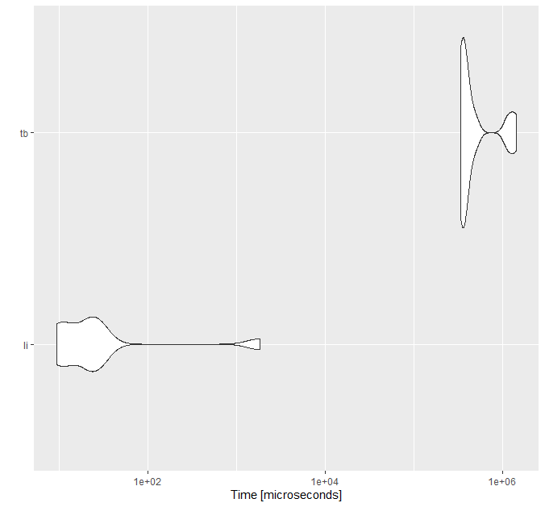

```{r optimisation first setup 40K, eval=FALSE}
Unit: microseconds
 expr      min       lq      mean   median       uq       max neval
   li      9.9     11.2    197.03     22.7     24.7    1794.8    10
   tb 446884.4 455029.3 570076.56 499940.9 610770.1 1080753.7    10
```
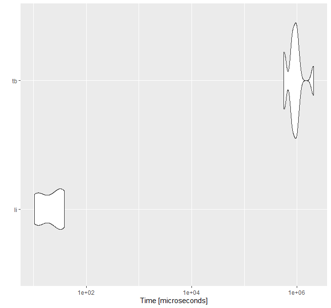

```{r optimisation first setup 50K, eval=FALSE}
Unit: microseconds
 expr      min       lq      mean   median       uq     max neval
   li     11.2     21.3    211.29     24.3     35.0    1899    10
   tb 539655.4 587587.5 851215.59 727172.8 793631.4 2136665    10
```
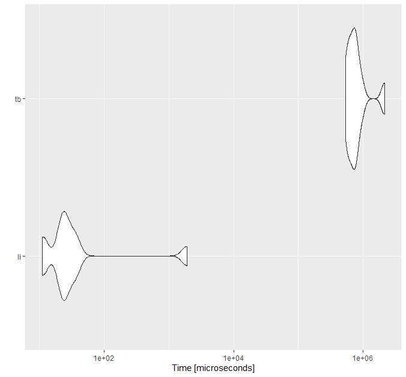

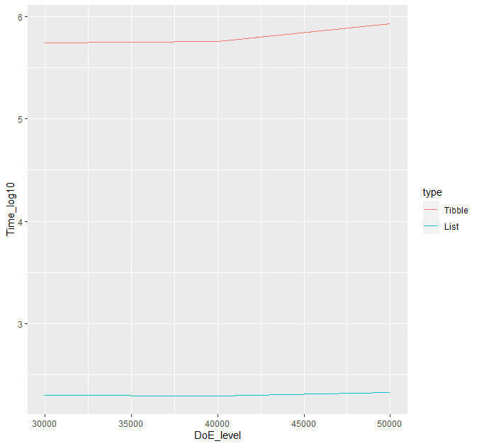

As we can see, the List type clearly outperforms the Tibble type.

#### Second setup : DoE from 1 to 50K, 100 Usms and 20 Dates

```{r optimisation second setup, eval=FALSE}
DoE <- c(1,10000,20000,30000,40000,50000)
li <- list()
tb <- list()
for (index in DoE) {

  opti_tb <- create_tibble2(USM_list_1996,index,100,sim_data_20)
  opti_li <- create_list2(USM_list_1996,index,100,sim_data_20)

  benchmark_opti <- microbenchmark(li = list_get_dates_and_var_values(opti_li,index,"lu96iN6_2","HR_2"),
                              tb = tibble_get_dates_and_var_values5(opti_tb,index,"lu96iN6_2","HR_2"),
                              times = 100)
  print(benchmark_opti)
  if (index == 1) {
    li <- summary(benchmark_opti)$mean[1]
    tb <- summary(benchmark_opti)$mean[2]
  }
  else {
    li <- append(li,summary(benchmark_opti)$mean[1])
    tb <- append(tb,summary(benchmark_opti)$mean[2])
  }

  print(ggplot2::autoplot(benchmark_opti))
}
df <- data.frame(DoE_level = DoE,Time_log10 = log10(tb), type = "Tibble")
df2 <- data.frame(DoE_level = DoE,Time_log10 = log10(li), type="List")
final <- rbind(df,df2)
ggplot(final)+geom_line(aes(DoE_level,Time_log10,colour=type))
```

```{r optimisation second setup 1, eval=FALSE}
Unit: microseconds
 expr   min     lq    mean median     uq    max neval
   li   9.8  10.20  32.696  11.35  12.00 2058.4   100
   tb 136.0 139.35 178.496 141.15 145.45 3120.4   100
```
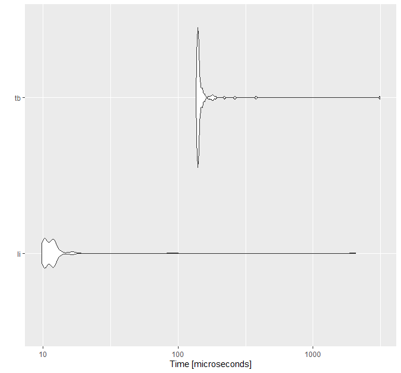

```{r optimisation second setup 10K, eval=FALSE}
Unit: microseconds
 expr     min      lq      mean  median       uq      max neval
   li     9.3    11.3    17.791    20.3    22.55     47.2   100
   tb 81703.3 83084.8 93291.748 84497.8 88800.65 405452.6   100
```
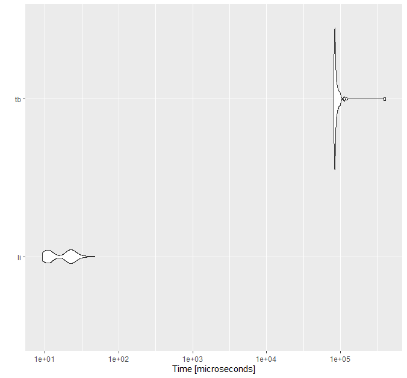

```{r optimisation second setup 20K, eval=FALSE}
Unit: microseconds
 expr      min        lq       mean   median        uq      max neval
   li      9.6     11.15     18.464     21.2     22.85     65.0   100
   tb 246706.5 255415.25 295829.551 262715.7 277763.45 941632.9   100
```
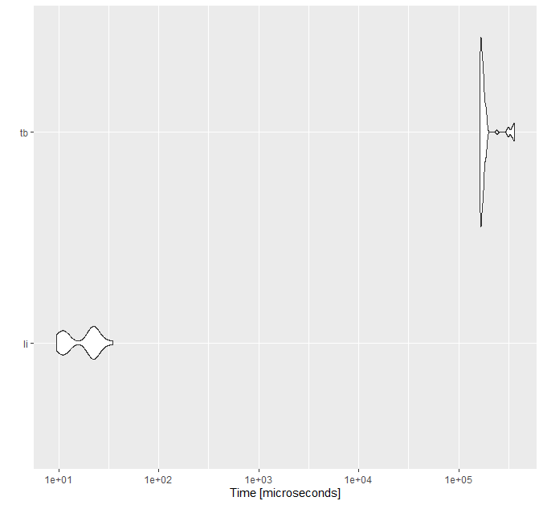

```{r optimisation second setup 30K, eval=FALSE}
Unit: microseconds
 expr      min        lq       mean    median       uq      max neval
   li      9.4     10.75     17.808     21.25     22.8     42.7   100
   tb 327876.9 336575.15 388535.080 345706.90 370712.5 936846.0   100
```
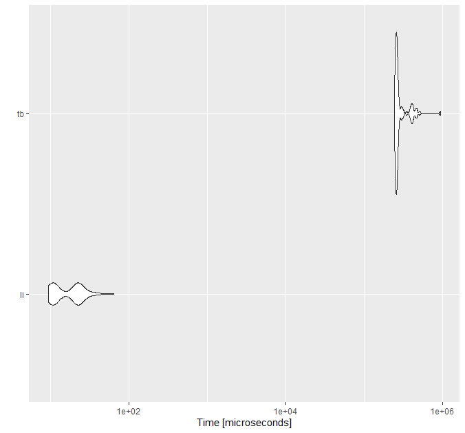

```{r optimisation second setup 40K, eval=FALSE}
Unit: microseconds
 expr      min        lq       mean    median       uq      max neval
   li      9.4     10.75     17.808     21.25     22.8     42.7   100
   tb 327876.9 336575.15 388535.080 345706.90 370712.5 936846.0   100
```


```{r optimisation second setup 50K, eval=FALSE}
Unit: microseconds
 expr      min        lq       mean   median        uq       max neval
   li      9.7     11.25     20.417     21.8     24.75      97.9   100
   tb 410061.3 420405.75 488412.518 432300.0 461170.65 1148163.5   100
```
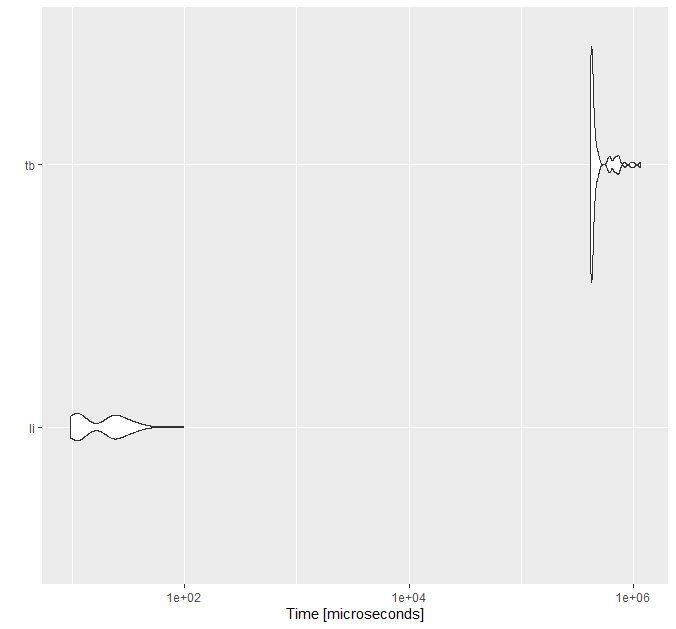


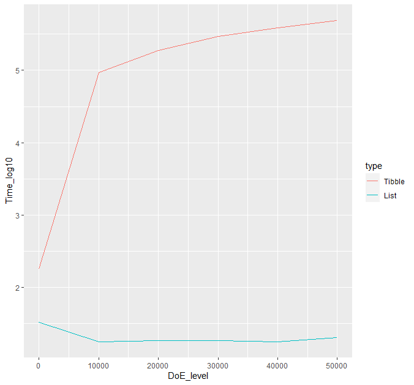

Once again, the List type is clearly better than the Tibble Type.

We can conlude by saying this, for the opmization's use case, the List type is clearly the most suited of the two. No matter is we use the optimization's use case's functions on the maximum we could process on windows OS way or on the usual use.

This can be explained by the fact that is the tibble function, there are more operation done than in the List function.

### Multi-simulation's extraction test

#### First setup : 1 DoE, Usms from 300K to 500K and 289 Dates
```{r multi first setup, eval=FALSE}
Usms <- c(300000,400000,500000)
li <- list()
tb <- list()
for (index in Usms) {

  multi_tb <- create_tibble2(USM_list_1996,1,index,sim_data_289)
  multi_li <- create_list2(USM_list_1996,1,index,sim_data_289)

  benchmark_multi <- microbenchmark(li = list_get_usm_names_and_var_values2(multi_li,1,"resmes","1996/01/05"),
                                  tb = tibble_get_usm_names_and_var_values(multi_tb,1,"resmes","1996-01-05"),
                                  times = 10)
  print(benchmark_multi)
  if (index == 300000) {
    li <- summary(benchmark_multi)$mean[1]
    tb <- summary(benchmark_multi)$mean[2]
  }
  else {
    li <- append(li,summary(benchmark_multi)$mean[1])
    tb <- append(tb,summary(benchmark_multi)$mean[2])
  }

  print(ggplot2::autoplot(benchmark_multi))
}
df <- data.frame(Nb_usms = Usms,Time_log10 = log10(tb), type = "Tibble")
df2 <- data.frame(Nb_usms = Usms,Time_log10 = log10(li), type="List")
final <- rbind(df,df2)
ggplot(final)+geom_line(aes(Nb_usms,Time_log10,colour=type))
```

```{r multi first setup 300K, eval=FALSE}
Unit: seconds
 expr      min       lq    mean   median       uq      max neval
   li 30.03657 31.10621 33.1981 32.20684 33.25297 43.39546    10
   tb 10.77291 12.35300 15.7576 16.89498 18.23755 21.03584    10
```
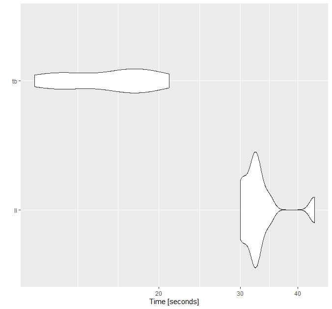

```{r multi first setup 400K, eval=FALSE}
Unit: seconds
 expr      min       lq     mean   median       uq       max neval
   li 49.89607 53.93406 65.37143 58.61680 72.76265 113.83305    10
   tb 16.67685 21.97553 24.47813 23.93011 28.44212  32.48015    10
```
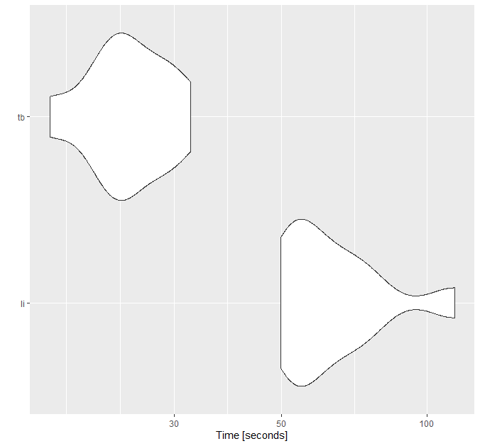

```{r multi first setup 500K, eval=FALSE}
Unit: seconds
 expr      min       lq     mean   median       uq      max neval
   li 60.78503 62.75192 64.61196 63.83016 66.76927 69.22558    10
   tb 24.38792 27.42882 28.29595 28.04894 28.63776 34.04064    10
```
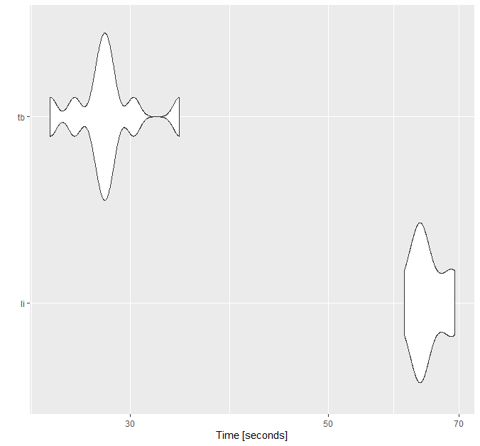

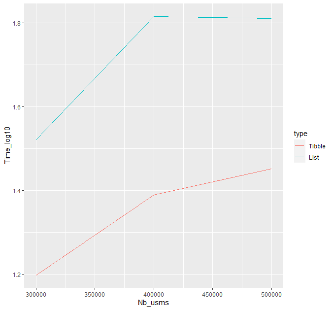

We can see that the Tibble is faster than the List in this first setup.

#### Second setup : 1 DoE, Usms from 300K to 1 Million and 5 Dates

```{r multi second setup, eval=FALSE}
Usms <- c(300000,400000,500000,600000,700000,800000,900000,1000000)
li <- list()
tb <- list()
for (index in Usms) {

  multi_tb <- create_tibble2(USM_list_1996,1,index,sim_data_5)
  multi_li <- create_list2(USM_list_1996,1,index,sim_data_5)

  benchmark_multi <- microbenchmark(li = list_get_usm_names_and_var_values2(multi_li,1,"resmes","1996/01/05"),
                                  tb = tibble_get_usm_names_and_var_values(multi_tb,1,"resmes","1996-01-05"),
                                  times = 10)
  print(benchmark_multi)
  if (index == 300000) {
    li <- summary(benchmark_multi)$mean[1]
    tb <- summary(benchmark_multi)$mean[2]
  }
  else {
    li <- append(li,summary(benchmark_multi)$mean[1])
    tb <- append(tb,summary(benchmark_multi)$mean[2])
  }

  print(ggplot2::autoplot(benchmark_multi))
}
df <- data.frame(Nb_usms = Usms,Time_log10 = log10(tb), type = "Tibble")
df2 <- data.frame(Nb_usms = Usms,Time_log10 = log10(li), type="List")
final <- rbind(df,df2)
ggplot(final)+geom_line(aes(Nb_usms,Time_log10,colour=type))
```

```{r multi second setup 300K, eval=FALSE}
Unit: milliseconds
 expr       min        lq       mean     median        uq       max neval
   li 3332.5954 3339.5471 3370.70196 3358.16350 3369.6317 3519.4980    10
   tb   41.6202   41.9078   45.28271   42.02375   44.3071   57.0164    10
```


```{r multi second setup 400K, eval=FALSE}
Unit: milliseconds
 expr       min       lq       mean    median        uq       max neval
   li 4430.1477 4484.035 4507.85451 4496.1532 4521.2569 4682.4781    10
   tb   48.3962   50.014   53.70746   54.5542   56.7664   57.2202    10
```


```{r multi second setup 500K, eval=FALSE}
Unit: milliseconds
 expr      min        lq       mean     median       uq       max neval
   li 5531.353 5628.6300 5676.91264 5639.03900 5661.009 5944.1791    10
   tb   66.707   67.4938   69.52306   69.28715   70.976   74.2585    10
```
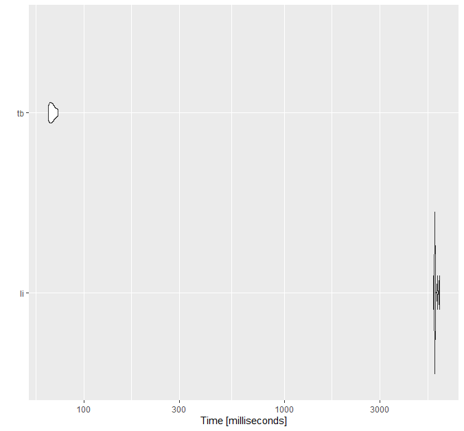

```{r multi second setup 600K, eval=FALSE}
Unit: milliseconds
 expr       min        lq      mean     median        uq       max neval
   li 6708.2760 6778.7596 6841.2064 6804.08765 6832.8290 7110.3530    10
   tb   78.7841   79.5768   82.5509   81.71745   84.1659   90.3038    10
```
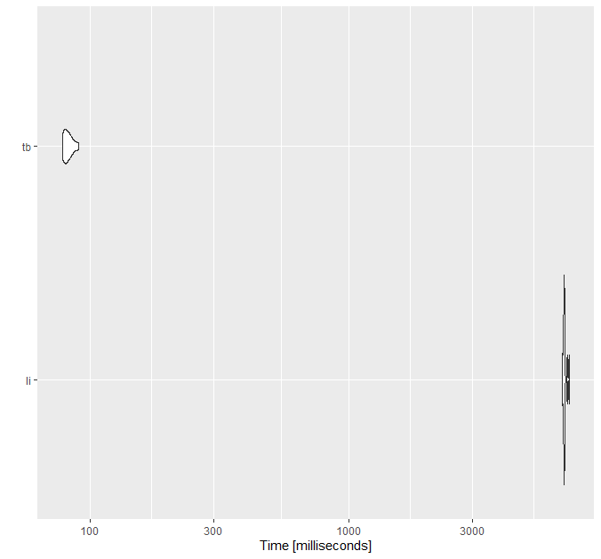

```{r multi second setup 700K, eval=FALSE}
Unit: milliseconds
 expr       min        lq       mean     median        uq       max neval
   li 7791.3232 7978.2077 8070.12769 7987.73695 8330.3859 8378.3290    10
   tb   77.5858   79.2717   88.04821   85.71205   91.6388  112.3219    10
```
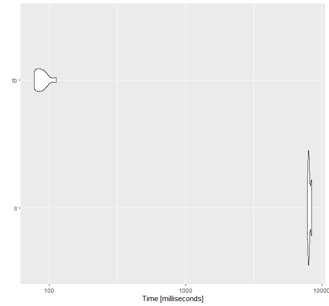

```{r multi second setup 800K, eval=FALSE}
Unit: milliseconds
 expr       min        lq     mean    median        uq       max neval
   li 8979.3875 9177.1169 9279.515 9203.1563 9507.6477 9537.6562    10
   tb  104.7584  105.8673  119.182  108.7374  112.6308  181.6905    10
```
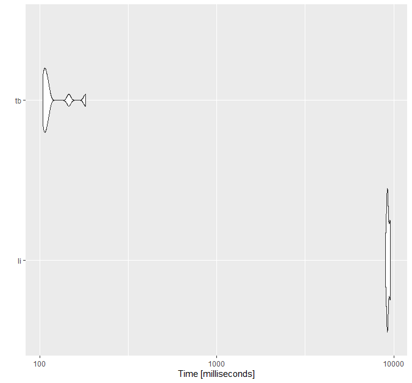

```{r multi second setup 900K, eval=FALSE}
Unit: milliseconds
 expr        min         lq       mean    median        uq        max neval
   li 10520.9608 10594.3660 10652.6125 10624.603 10768.267 10787.8084    10
   tb   109.7933   117.9024   120.9751   119.624   124.017   131.8791    10
```
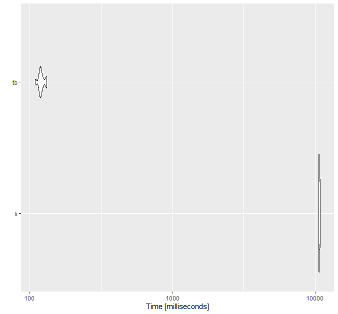

```{r multi second setup 1M, eval=FALSE}
Unit: milliseconds
 expr        min         lq       mean     median         uq        max neval
   li 11736.8582 11759.4140 11863.0019 11844.8683 11973.3518 11990.8012    10
   tb   131.0447   133.0592   153.5552   135.4246   138.6876   229.7395    10
```
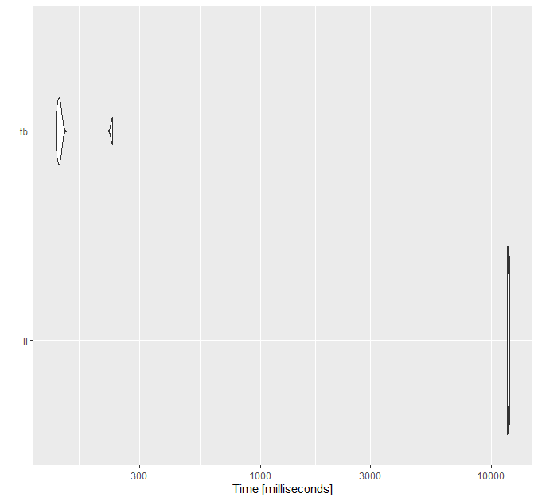


The results on this graph follow the results on the previous one. The Tibble storage method is more adapted to the multi-simulation use case than the List.

We can explain this by the fact that there are more operation done in the List function than in the Tibble function.

### Analysis' extraction test

#### First setup : DoE from 30K to 50K, 10 Usms and 289 Dates

```{r analysis first setup,eval=FALSE}
DoE <- c(30000,40000,50000)
li <- list()
tb <- list()
for (index in DoE) {

  analysis_tb <- create_tibble2(USM_list_1996,index,10,sim_data_289)
  analysis_li <- create_list2(USM_list_1996,index,10,sim_data_289)

  benchmark_analysis <- microbenchmark(li = list_get_DOE_and_var_values2(analysis_li,"lu96iN6_2","HR_3","1996/01/05"),
                                     tb = tibble_get_DOE_and_var_values(analysis_tb,"lu96iN6_2","HR_3","1996-01-05"),
                                     times = 10)
  print(benchmark_analysis)
  if (index == 30000) {
    li <- summary(benchmark_analysis)$mean[1]
    tb <- summary(benchmark_analysis)$mean[2]
  }
  else {
    li <- append(li,summary(benchmark_analysis)$mean[1])
    tb <- append(tb,summary(benchmark_analysis)$mean[2])
  }

  print(ggplot2::autoplot(benchmark_analysis))
}
df <- data.frame(DoE_level = DoE,Time_log10 = log10(tb), type = "Tibble")
df2 <- data.frame(DoE_level = DoE,Time_log10 = log10(li), type="List")
final <- rbind(df,df2)
ggplot(final)+geom_line(aes(DoE_level,Time_log10,colour=type))
```

```{r analysis first setup 30K, eval=FALSE}
Unit: milliseconds
 expr       min       lq     mean   median       uq      max neval
   li  895.7058 1068.883 1244.522 1140.189 1515.681 1763.041    10
   tb 1031.7517 1224.850 1815.861 1367.381 1576.972 5389.302    10
```
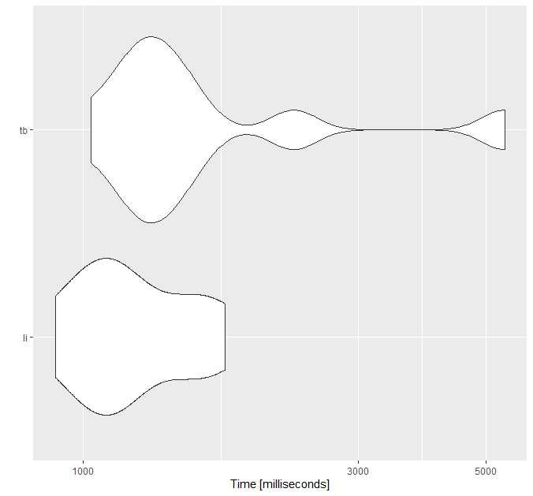

```{r analysis first setup 40K, eval=FALSE}
Unit: seconds
 expr      min       lq     mean   median       uq       max neval
   li 1.193294 1.281470 1.874457 1.541375 2.384668  3.020695    10
   tb 2.988511 4.388414 6.791350 6.532992 8.090314 11.513008    10
```
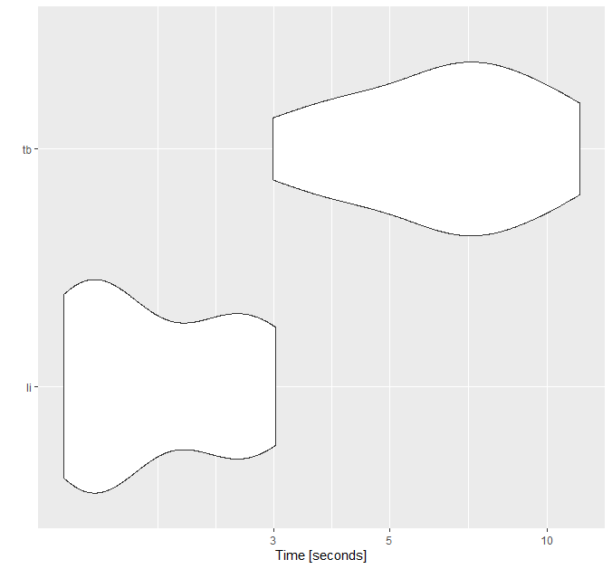

```{r analysis first setup 50K, eval=FALSE}
Unit: seconds
 expr       min        lq      mean    median        uq      max neval
   li  1.568641  1.622991  3.196903  2.094541  4.051228 10.51410    10
   tb 10.004383 12.427741 14.475949 13.366610 15.652602 20.54261    10
```
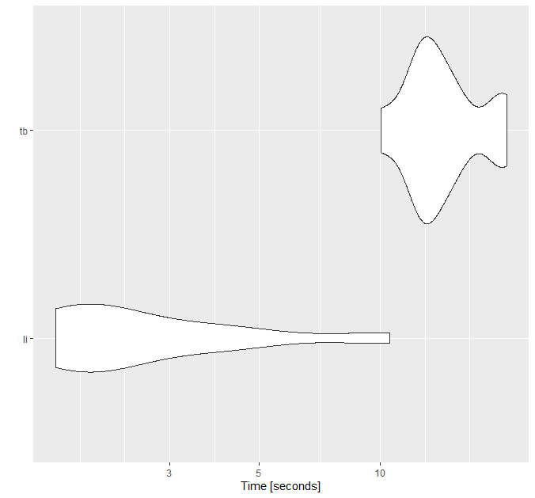

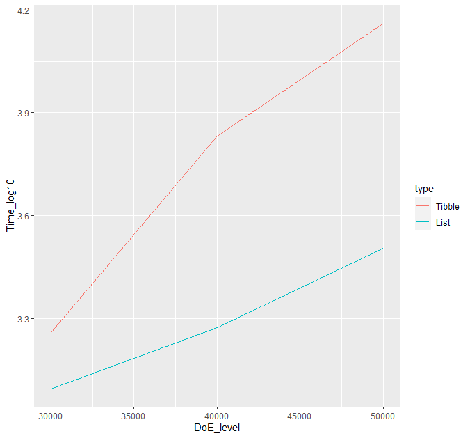

We can see that the List are faster than the Tibble on these tests.

#### Second setup : DoE from 10K to 50K, 10 Usms and 5 Dates

```{r analysis second setup,eval=FALSE}
DoE <- c(10000,20000,30000,40000,50000)
li <- list()
tb <- list()
for (index in DoE) {

  analysis_tb <- create_tibble2(USM_list_1996,index,10,sim_data_5)
  analysis_li <- create_list2(USM_list_1996,index,10,sim_data_5)

  benchmark_analysis <- microbenchmark(li = list_get_DOE_and_var_values2(analysis_li,"lu96iN6_2","HR_3","1996/01/05"),
                                     tb = tibble_get_DOE_and_var_values(analysis_tb,"lu96iN6_2","HR_3","1996-01-05"),
                                     times = 10)
  print(benchmark_analysis)
  if (index == 10000) {
    li <- summary(benchmark_analysis)$mean[1]
    tb <- summary(benchmark_analysis)$mean[2]
  }
  else {
    li <- append(li,summary(benchmark_analysis)$mean[1])
    tb <- append(tb,summary(benchmark_analysis)$mean[2])
  }

  print(ggplot2::autoplot(benchmark_analysis))
}
df <- data.frame(DoE_level = DoE,Time_log10 = log10(tb), type = "Tibble")
df2 <- data.frame(DoE_level = DoE,Time_log10 = log10(li), type="List")
final <- rbind(df,df2)
ggplot(final)+geom_line(aes(DoE_level,Time_log10,colour=type))
```

```{r analysis second setup 10K, eval=FALSE}
Unit: milliseconds
 expr      min       lq      mean    median       uq      max neval
   li 115.0643 117.0258 121.00347 121.65650 123.2250 137.0018   100
   tb  10.8133  10.9368  11.13563  10.98905  11.0636  15.0299   100
```
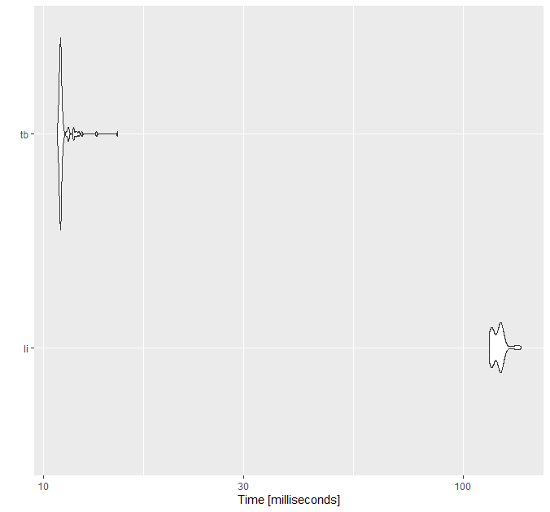

```{r analysis second setup 20K, eval=FALSE}
Unit: milliseconds
 expr      min       lq     mean   median        uq      max neval
   li 229.6689 233.0720 238.1733 235.2483 237.64985 399.8650   100
   tb  17.9800  18.2047  20.8205  18.4284  19.65465 189.1118   100
```
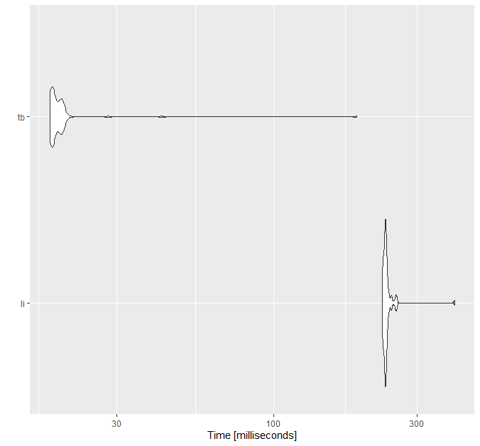

```{r analysis second setup 30K, eval=FALSE}
Unit: milliseconds
 expr      min       lq      mean   median       uq      max neval
   li 338.4934 348.0758 359.21133 353.6232 357.3131 521.1849   100
   tb  25.1292  25.3916  27.08452  27.0208  27.5091  42.4875   100
```
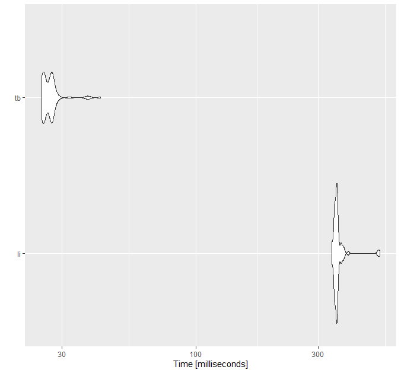

```{r analysis second setup 40K, eval=FALSE}
Unit: milliseconds
 expr      min        lq      mean   median        uq      max neval
   li 454.6006 465.93530 479.08876 470.4754 476.00065 640.1500   100
   tb  32.1294  33.21705  35.08178  35.0008  35.27345  52.7535   100
```
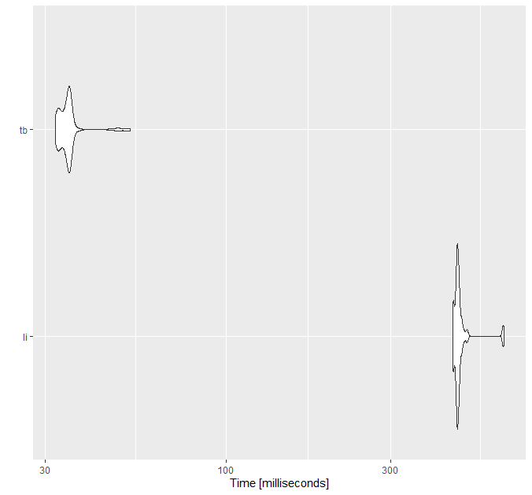

```{r analysis second setup 50K, eval=FALSE}
Unit: milliseconds
 expr      min       lq      mean    median       uq      max neval
   li 577.9685 588.8047 600.08516 594.98885 602.7215 794.2176   100
   tb  39.5661  42.6127  43.75174  43.04715  44.3716  66.4900   100
```
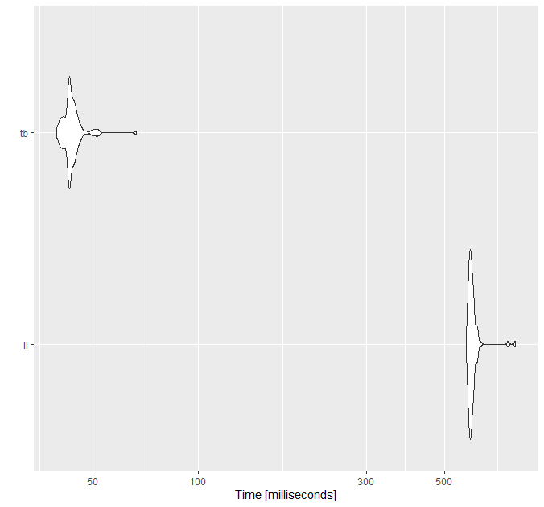


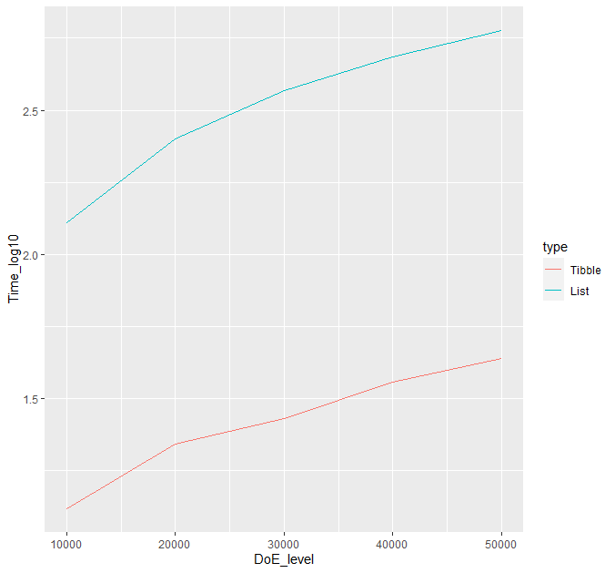

Unlikely to the previous results, this time it's the Tibble that is faster than the List. We maybe can explain that on the way the dplyr::filter function has been coded. Indeed, in the List function, the wanted Usms are get first, then their variables and values are processed while in the Tibble function, each tibble's row is tested. And this process takes more time when they are 289 dates per Usm than when they are only 5. We can also conclude that it is faster to search information in a tibble using the dplyr::filter function than in a List.

At the end of these tests, we cannot conclude on which storage method is the most suited because they both had won 3 tests. However, we can say that the Tibble storage method has the advantage because it won more tests on current use of extraction's functions than the List storage method.
