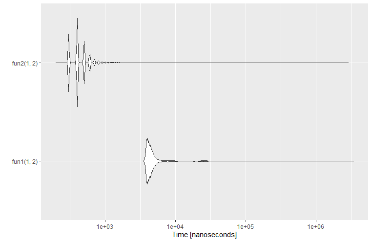
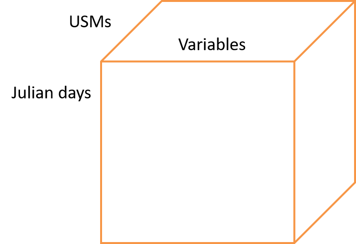

# Tests on R data structures

## Introduction

The sticsRpacks package suite have to be easy to use **and** highly efficient. To do so, the reading/writing of inputs/outputs and data manipulation have to use the most efficient data structure and/or functions from R.
Some tests have to be made before adopting the right set of functions and data structures for each use case. The aim of this document is to list the tests that need to be done and to present the results.

## Tools
The tools to use would be the `microbenchmark` package along with `ggplot2::autoplot`:

```r
library(microbenchmark)
fun1= function(x,y){
  mean(c(x,y))
}

fun2= function(x,y){
  (x+y)/2
}
test= microbenchmark(fun1(1,2),fun2(1,2), times= 10000)
ggplot2::autoplot(test)
```
This piece of code gives this plot:


To test the number of copy R makes, we can use `base::tracemem()`, and to make a more in-depth profile, the [profiler from RStudio](https://rstudio.github.io/profvis/) can be used.

For data structure, several types are possible:
* A `list`;
* An `R6`/`Reference class` object (more information needed);
* A `data.frame`;
* A [`tibble`](https://tibble.tidyverse.org/) (possibly more efficient than `data.frame` if using [tidyverse](https://www.tidyverse.org/), to test);
* A `data.table` (more efficient than `data.frame` if using [data.table](https://github.com/Rdatatable/data.table/wiki), to test);
* A `vector`/`matrix`...
* ...


To manipulate coplex lists, the package [`purrr`](https://purrr.tidyverse.org/) is recommended.


## Tests

>Note: Some tests are pure R tests, so the answer can potentially be found on some websites such as [stackoverflow](https://stackoverflow.com/questions/tagged/r), [advanced R](https://adv-r.hadley.nz/), or any other resource.

### Memory usage
Base R uses a copy-on-modify paradigm, so R makes a copy of an object whenever it is modified. However, there is a possibility to pass-by-reference using the Reference classes or the R6 objects. The impact of each paradigm has to be tested for data structures that need high performance writing.

Passing a data structure down to many functions could have a performance impact, and we can possibly test it using a recursive function that modifies the value inside the data structure at the end has a high performance impact or not.

For example, if we execute the following code we can see that the object is only copied at the end (so its efficient):
```r
recursive_fun= function(struct, i, n, new_val){
  if(i<n){
    recursive_fun(struct, i+1L, n,new_val)
  }else{
    struct[1]= new_val
  }
  struct
}

st= list(a= 1, b=2)
tracemem(st)
recursive_fun(st,1,1000,56.0)
```
`tracemem` shows only one copy, so the list is copied only once.

**This test has to be repeated for Reference classes and other kind of objects.**

The impact of the copy-on-modify will be tested on each test case in this document using several modifications on a data structure in a function (>10000 loops).  

**In general, all data structure will be pre-allocated to avoid copy. If the dimension is unknown, possibly pre-allocate with higher dimensions (e.g. many columns or rows).**

### Performance
Test the performance when constructing and/or modifying an object (Reference classes vs list vs `data.frame`...).

### IO
Test alternative ways of reading / writing files:
* which package to use (`data.table`, `vroom`...)
* whole file read in-memory or read line by line and extract only the value needed.

## Data structure

### USMs
The data structure that defines the inputs: USM data  + some parameters. This data structure contains:
* the data for the USMs (see `USM.xml` files);
* The name of the `.obs` file associated to the USM (optional);
* A list of parameters to modify along with their new values.

For example the user would have several USMs on his computer, and he wants to use some, except that he needs to change the meteorology or some parameters. This data structure will contain the information about each USM (which file to use), and the parameters he wants to change along with their values. The user can generate new USMs from the pre-existing ones, or work on a selection of the USMs.

Expected format: A list, a R6/Reference class object (more information needed), a [`tibble`](https://tibble.tidyverse.org/). The tibble would have lists inside rows, e.g. a `parameter` column containing a list of parameters.

Expected size: Up until +100 000, possibly millions USMs. The length of the parameters is possibly up to 300 (probably rare), but generally more around 5/10.

Constraints: user-friendly modifications. A priori this data structure is often read by functions, not much modified.

Tests:
* Generation of an initial list, extraction of a sub-list, modification of the list (add one USM);  
* Fields reading / modification (add parameter values)
* The tests listed in the Test paragraph.


### Model outputs

This data structure will store:
* the simulations outputs (along with the variable names);
* the date;
* the SituationName names (i.e. USM for STICS);
* design of experiment (DOE), a variation of one or several model input values. This is optional and typically used for sensitivity/uncertainty analyses. If not used, the size is 1;

and maybe later:
* the observations (optional);
* phenological stage (optional). If the outputs are expected at given stages (date + stage);
* The plant index (optional, for intercropping).

The variables may change according to the SituationName and the dates along the SituationName and the variable (typically for observations).  

Expected format (several possibilities):

* a big `tibble` with one column for the USM, one column for the DOE, one column for the date, one column for the stage, one column for the plant index, one column for each variable (e.g. LAI, masec) and one column for the "origin" that is either measured or observed, e.g.:  

  |USM   | DOE|origin | plant|Date       |stage   | lai_n| masec_n| ...
  |:-----|---:|:------|-----:|:----------|:-------|-----:|-------:|
  |usm_1 |   1|obs    |     1|2009-03-02 |NA      |   0.1|     2.1|
  |usm_1 |   1|obs    |     1|2009-03-18 |NA      |   0.6|     3.4|
  |usm_1 |   1|obs    |     1|2009-07-04 |mat     |   0.7|    12.3|
  |usm_1 |   1|sim    |     1|2009-01-01 |NA      |     0|       0|
  |usm_1 |   1|sim    |     1|2009-01-02 |NA      |     0|       0|
  |usm_1 |   1|sim    |     1|2009-01-03 |NA      |     0|       0|
  ...
  |usm_1 |   1|sim    |     1|2009-07-09 |mat     |  0.82|    13.6|
  ...
  |usm_1 |   1|sim    |     1|2009-12-31 |NA      |     0|    14.5|
  |usm_2 |   1|obs    |     1|2010-03-12 |NA      |  0.11|     2.2|
  |usm_2 |   1|obs    |     1|2010-03-21 |NA      |   0.7|     3.6|
  |usm_2 |   1|obs    |     1|2010-07-02 |mat     |  0.75|    12.8|
  |usm_2 |   1|sim    |     1|2010-01-01 |NA      |     0|       0|
  |usm_2 |   1|sim    |     1|2010-01-02 |NA      |     0|       0|
  |usm_2 |   1|sim    |     1|2010-01-03 |NA      |     0|       0|
  ...
  |usm_2 |   1|sim    |     1|2010-07-05 |mat     |  0.85|    13.8|
  ...
  |usm_2 |   1|sim    |     1|2010-12-31 |NA      |     0|    14.7|

(this case is for an optimization-like case (only one DOE) and for a single crop, but DOE and plant may take different values for other cases).

  
* A list of `tibble`:
  + obj$DOE$situationName: data.frame[col1=date(type POSIXct), col2-n=varValues] 

* A 4D Array:
For example a replication of the cube (Fig. 2) for each row of the design of experiment.


* A list of `tibble`:
  + obj$situationName$VarName: data.frame[col1= DOE, col2=date(type POSIXct), col3= stage(character vector), col4= plant(integer), col5=varValues]
  + Or in another format data$situationName$VarName: data.frame[col1= DOE, col2=date(type POSIXct),col3= stage(character vector), col4= plant, col5=obsValues,col6=simValues]
 
* A named list of lists:
  + obj$SituationName$VarName
  + obj$SituationName$Data[DOE,dates,plant,var]
  + obj$SituationName$Dates
  + obj$SituationName$Stages, possibly with several values for each date, e.g. c("mat","rec").

with obj being either sim or obs.

> NB: a `data.frame` or a `tibble` can contain a list inside a element, e.g.:
```r
tb_test= tibble::tibble(a= 2, b= 1)
tb_test$b[1]= list(c(1,2))
tb_test$b
R output:
[[1]]
[1] 1 2
Or:
df_test= data.frame(a= 2, b= 1)
df_test$b[1]= list(c(1,2))
df_test$b
R output:
[[1]]
[1] 1 2
```

Expected size:
* Multi-simulation: possibly millions USMs, more probably no observations, and length DOE is 1, few dates (few stages in general).
* Sensitivity/uncertainty analyses: dozen thousands DOE, no observations in general, < 100 USM (generally ~10 max), dates ~ from 1 to 360.
* Optimization: 1 (no storage) DOE to dozen thousands. Number of variables: 1 to 10 (sim and obs), 1 to 10 dates, 10 to 500 USMs.

Constraints: Highly efficient (many read/write, passing from functions to another, mathematical operations) for optimizations, sensitivity analyses or multi-simulations. Keep in mind a degree of user-friendliness for access to values (e.g. custom plots or statistics).

Tests:
Prerequisite: the simulation outputs and the observations will be read from two separate files and will be returned as a `data.frame`.

* Test the making of the structure from the sim [and obs] `tibble`s read in sequence by USM and DOE (all USMs for first line of DOE, then for second line, ...) => insert iteratively the results for new USMs and DOE into an existing data_structure (create an insert_data function taking in input the `tibble` read and append it in the (big) data-structure, see. SticsOnR::stics_wrapper and SticsOnR::get_daily_results).
* Data extraction:
  + one DOE line, one USM, one variable, all dates (optimization)
  + one DOE line, all USMs, one variable, one date (multi-simulation)
  + all DOE line, one USM, one variable, one date  (Sensitivity / Uncertainty analysis)
* Intersection with observations
* Data extraction + mathematical operation:
  + sum of obs-sim squared on all USMs (`sqrt(obs-sim)`), all variables, all dates at once;  
  + the product of each sum of obs-sim of the USMs, all variables, all dates. So the sum is grouped by USM, and the product is done on all resulting sums. For `data.frames`, use either `dplyr` or `data.table`.
  + Statistics computed on sensitivity outputs: e.g. mean for each variable, each date, each USM.
