```{r setup, include=FALSE}
knitr::opts_chunk$set(echo = TRUE,
                      cache = TRUE,
                      cache.lazy = TRUE,
                      warn = -1)
source("output_tests.R")
```


# Introduction

Currently, we're using a temporary method in order to store the model output before processing them. This method is a list which has two levels. The first level is the DoE level and the second is the Usm which contains a tibble with the variables and their values.

We wanted to know if a different storage method was more adapted to our problem. So, we have implemented a second storage method which consists in a single tibble which contains all the information for each DoE and each Usm.

There are two parts in this document. The first is a description part where we'll print the storage methods, in order to make you understand how it is store inside the differents methods.
The second part is the tests part where we first describe the functions used for extraction and their use cases. And then, the results of the extraction tests for each use case.

# Methods

Let's print the storage methods. For this example, the methods contain 2 DoE's level and 6 Usms.

## First method : List

```{r print list}
# DoE, usm_number
li <- create_list(USM_list_1996,2,6,sim_data)
li
```

## Second method : Tibble

```{r print tibble, warning=FALSE}
# DoE, usm_number
tb <- create_tibble(USM_list_1996,2,6,sim_data)
tb
```

# Tests

## Use cases

First, let us describe the use cases. There are 3 use cases : Optimization, Multi-Simulation and Analysis.
Each use case has one function matching with the storage type, so each use case has two functions, one per storage method.

Now, let's see what returns each function and how they are called.

### Optimization's use case

We're beginning with the optimization's use case.
This function returns all the values for a variable with the dates.
It takes as parameters a DoE level, a Usm name and a variable name.

```{r optimization function}

res <- tibble_get_dates_and_var_values(tb,1,"bo96iN+_2","HR_1")
res

li2 <- list_get_dates_and_var_values(li,1,"bo96iN+_2","HR_1")
li2

```

### Multi-simulations' use case

This function returns the Usms names with the variable's values.
It takes as parameters a DoE level, a variable name and a date.

```{r multisim function,warning=FALSE}

res <- tibble_get_usm_names_and_var_values(tb,1,"HR_4","1996-01-05")
res

li2 <- list_get_usm_names_and_var_values(li,1,"HR_4","1996/01/05")
li2

```

### Analysis' use case

This function returns the DoE levels and the variable's values.
It takes as parameters an Usm name, a variable name and a date.

```{r analysis function, warning=FALSE}

res <- tibble_get_DOE_and_var_values(tb,"bo96iN+_2","HR_3","1996-01-05")
res

li2 <- list_get_DOE_and_var_values(li,"bo96iN+_1","HR_3","1996/01/05")
li2

```

## Tests' environment

### Work station

The following tests have been realised on the Windows OS 64 bit version. The R memory allocated initially was 8143 bytes. For some tests, the memory was raised to 8To via the memory.limit(size=) function. The workstation has a Intel Core i5-8400 CPU 2.80GHz processor and a 8Go Ram.

### Protocole

All the tests have been realised on a R script. The R memory was cleared between tests by deleting unused variables and calling the garbage collector. Also, the only active program on the computer was RStudio, in order to prevent disturbances during the tests.

### Maximum data generated

#### List

All the structures generated below didn't need any memory boost.

#### Tibble 

First, for the optimization's use case with 20 dates, the maximum DoE level we can generate with 100 Usms is 130K but we can't process it. Instead, the maximum DoE level we can process is 120K, with a memory boost. Without, we can generate a 40K DoE level.
In the case with 289 dates and 10 Usms, the maximum DoE level generated is 50K with boost and 20K without.

Then, for the multi-simulation's use case with 5 dates, the maximum Usms we can generate with a single DoE level is 20M with memory boost and 7M500K Usms without. In the case we have 289 dates, the maximum generated is 600K Usms but we can only process 500K Usms with memory boost and without we can generate 140K Usms.

Finally, for the analysis' use case with 5 dates and 10 Usms, we can generate a 4M DoE level with boost and a 1M DoE level without. In the case we have 289 dates, the maximum level DoE generated is 50K with boost and without it is 20K.

### Functions

#### Creation

We have tested 3 creation functions for the tibble and 2 for the list.

For the tibble, the first creation function use a pre allocated tibble. The second function and the third are without pre allocation. The last one, is not build the same way as the others, the tibble is organized by usm then by DoE which is the contrary of the previous one. The third function is designed to gain memory weight and allows us to generate tibble with higher dimensions than the previous functions. The last creation function is also designed for an extraction test to be faster due to the way it is build.

As results, the third function doesn't meet our expectations, it doesn't allow us to create tibble with higher dimensions and it is not faster on the extraction tests.

For the list, the first creation function is a pre allocated function and the second is a non pre allocated function.

#### Optimization's use case

For this extraction test, we have 2 functions for the tibble. The first uses the functions of the dplyr package, while the second uses the subset function.
The second function is faster, because it have less operation to do.

#### Multi-simulation's use case

For this extraction test, we have 2 functions for the list. The first function returns a pre allocated list while the second returns a non pre allocated tibble. The second function is faster because the pre allocation takes too much time.

Moreover, the second function had 2 versions, one with a binding on the name at the end and one with the binding on the name at the beginning. The results are clear, the function with binding on the name at the beginning is faster than the other.

#### Analysis' use case

This extraction test is the same as the previous. It has 2 functions for the list. The two functions have the same specificities as the multi-simulation's use case. The results are exactly the same as the multi-simulation's use case. 

## Creation's tests

Now it is time for the instanciations' tests of each storage method. However, as the current method is only temporary and we are not sure if the second will be the one that suits us the most, the instanciations' tests are not very important at the moment. If you want some details on it, you can go on the Rmd file and delete the echo=FALSE on each chunk and generate again the document.

```{r tests creation tibble, eval=FALSE, echo=FALSE}

# below is this chunk's title on the rmd
### Tibble Creation Tests

benchmark <- microbenchmark(create_tibble(USM_list_1996,10,500,sim_data),
                            create_tibble2(USM_list_1996,10,500,sim_data),
                            create_tibble3(USM_list_1996,10,500,sim_data),
                            times = 10)

benchmark

ggplot2::autoplot(benchmark)


 benchmark
Unit: milliseconds
                                             expr          min           lq         mean       median           uq          max neval
  create_tibble(USM_list_1996, 10, 500, sim_data) 1205804.5078 1226858.2402 1697771.5727 1714676.4753 2106422.4782 2266344.2604    10
 create_tibble2(USM_list_1996, 10, 500, sim_data)     116.8153     138.8559     275.4744     172.8570     345.1159     604.2929    10
 create_tibble3(USM_list_1996, 10, 500, sim_data)     749.7182     775.1101    1084.8669     895.9864    1170.2665    1898.2863    10

# below is the caption and path to plot of the benchmark above. That line should be uncomment and be put after the chunk's end, with the right path to the benchmark_tibble_creation.png file
#
```


```{r tests creation list,eval=FALSE,echo=FALSE}

# below is this chunk's title on the rmd
### List Creation Tests

benchmark <- microbenchmark(create_list(USM_list_1996,10,50,sim_data),
                            create_list2(USM_list_1996,10,50,sim_data),
                            times = 10)
benchmark

ggplot2::autoplot(benchmark)


```


```{r tests creation best, eval=FALSE,echo=FALSE}

# below is this chunk's title on the rmd
### Best Creation Tests

tb1 = create_tibble2(USM_list_1996,10,500,sim_data)
weights <- object.size(tb1)
li1 = create_list2(USM_list_1996,10,500,sim_data)
weights <- append(weights,object.size(li1))
tb2 = create_tibble2(USM_list_1996,100,500,sim_data)
weights <- append(weights,object.size(tb2))
li2 = create_list2(USM_list_1996,100,500,sim_data)
weights <- append(weights,object.size(li2))

plot_weight <- data.frame(Instanciation_modes = c("tb1","li1","tb2","li2"), weights = weights)

graph <- ggplot(data = plot_weight,aes(x =Instanciation_modes, y=weights)) + geom_bar(stat = "identity")
print(graph)

benchmark <- microbenchmark(tb1 = create_tibble2(USM_list_1996,10,500,sim_data),
                            li1 = create_list2(USM_list_1996,10,500,sim_data),
                            tb2 = create_tibble2(USM_list_1996,100,500,sim_data),
                            li2 = create_list2(USM_list_1996,100,500,sim_data),
                            times = 10)
benchmark

ggplot2::autoplot(benchmark)


```

## Extraction's tests

We arrive now at the most important part, the extraction's tests. In this part, we will compare the results of each storage method on each use case.

For each use case's tests, optimization, multisimulation and analysis, we have done two differents types of tests. The first one, which is called "first setup" is based on the maximum of DoE and Usms we can generate and process through the functions, on the windows OS.
The second type of test, called "second setup" consists on the tests that are usually made using the functions.

Each type of test are made with some complementary tests in order to make graphics on the functions' execution time.

### Optimization's extraction test

#### First setup : DoE from 1 to 50K, 10 Usms and 289 Dates
```{r optimisation first setup,eval=FALSE}
DoE <- c(1,10000,20000,30000,40000,50000)
li <- list()
tb <- list()
for (index in DoE) {
  opti_tb <- create_tibble3(USM_list_1996,index,10,sim_data_289)
  opti_li <- create_list2(USM_list_1996,index,10,sim_data_289)

  benchmark_opti <- microbenchmark(li = list_get_dates_and_var_values(opti_li,index,"lu96iN6_2","HR_2"),
                                   tb = tibble_get_dates_and_var_values5(opti_tb,index,"lu96iN6_2","HR_2"),
                                   times = 100)
  print(benchmark_opti)
  if (index == 1) {
    li <- summary(benchmark_opti)$median[1]
    tb <- summary(benchmark_opti)$median[2]
  }
  else {
    li <- append(li,summary(benchmark_opti)$median[1])
    tb <- append(tb,summary(benchmark_opti)$median[2])
  }
  print(ggplot2::autoplot(benchmark_opti))
  gc()
}
df <- data.frame(DoE_level = DoE,Time_log10 = log10(tb), type = "Tibble")
df2 <- data.frame(DoE_level = DoE,Time_log10 = log10(li), type="List")
final <- rbind(df,df2)
ggplot(final)+geom_line(aes(DoE_level,Time_log10,colour=type))
```

To prevent polluting the document with too much benchmark plot, we only plot the run with the highest dimension. The others are in the annexes part at the end of the document.

##### DoE = 50K

```{r optimisation first setup 50K, eval=FALSE}
Unit: microseconds
 expr      min       lq       mean    median       uq       max neval
   li      8.6     10.4     18.884     20.05     23.5     121.1   100
   tb 589403.9 600579.1 795663.377 624743.90 655843.2 5550306.0   100
```


##### Optimization's first setup's graph

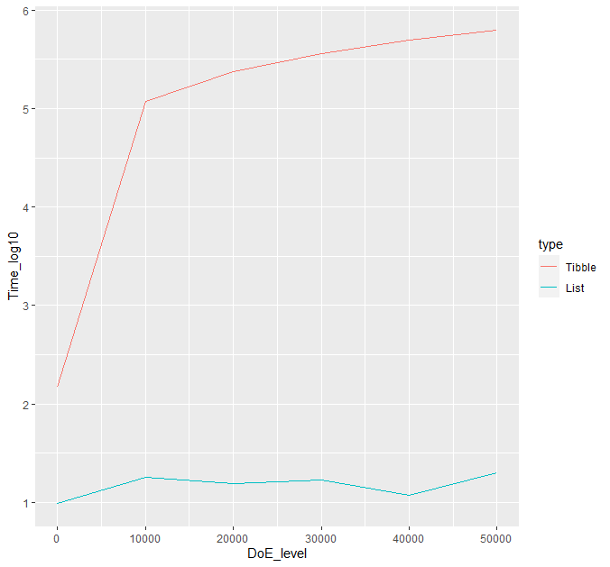

As we can see, the List type clearly outperforms the Tibble type.

#### Second setup : DoE from 1 to 50K, 100 Usms and 20 Dates

```{r optimisation second setup, eval=FALSE}
DoE <- c(1,10000,20000,30000,40000,50000)
li <- list()
tb <- list()
for (index in DoE) {

  opti_tb <- create_tibble3(USM_list_1996,index,100,sim_data_20)
  opti_li <- create_list2(USM_list_1996,index,100,sim_data_20)

  benchmark_opti <- microbenchmark(li = list_get_dates_and_var_values(opti_li,index,"lu96iN6_2","HR_2"),
                              tb = tibble_get_dates_and_var_values5(opti_tb,index,"lu96iN6_2","HR_2"),
                              times = 100)
  print(benchmark_opti)
  if (index == 1) {
    li <- summary(benchmark_opti)$median[1]
    tb <- summary(benchmark_opti)$median[2]
  }
  else {
    li <- append(li,summary(benchmark_opti)$median[1])
    tb <- append(tb,summary(benchmark_opti)$median[2])
  }
  print(ggplot2::autoplot(benchmark_opti))
  gc()
}
df <- data.frame(DoE_level = DoE,Time_log10 = log10(tb), type = "Tibble")
df2 <- data.frame(DoE_level = DoE,Time_log10 = log10(li), type="List")
final <- rbind(df,df2)
ggplot(final)+geom_line(aes(DoE_level,Time_log10,colour=type))
```

##### DoE = 50K

```{r optimisation second setup 50K, eval=FALSE}
Unit: microseconds
 expr      min        lq       mean   median      uq       max neval
   li      8.9     10.75     42.861     20.4      21    2394.7   100
   tb 531515.0 538636.45 792210.938 963595.8 1005728 2082968.6   100
  tb2 531117.3 538880.15 784121.620 578004.4 1005135 2482537.0   100
```


##### Optimization's second setup's graph

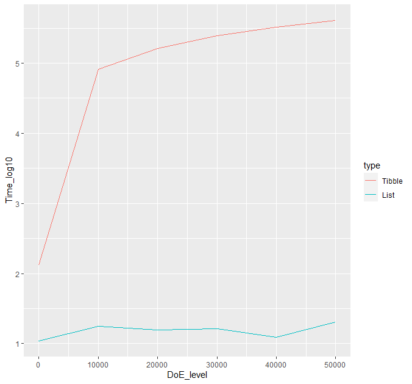

Once again, the List type is clearly better than the Tibble Type.

We can conlude by saying this, for the opmization's use case, the List type is clearly the most suited of the two. No matter is we use the optimization's use case's functions on the maximum we could process on windows OS way or on the usual use.

This can be explained by the fact that is the tibble function, there are more operation done than in the List function.

### Multi-simulation's extraction test

#### First setup : 1 DoE, Usms from 100K to 500K and 289 Dates
```{r multi first setup, eval=FALSE}
Usms <- c(100000,200000,300000,400000,500000)
li <- list()
tb <- list()
for (index in Usms) {

  multi_tb <- create_tibble3(USM_list_1996,1,index,sim_data_289)
  multi_li <- create_list2(USM_list_1996,1,index,sim_data_289)

  benchmark_multi <- microbenchmark(li = list_get_usm_names_and_var_values2(multi_li,1,"resmes","1996/01/05"),
                                  tb = tibble_get_usm_names_and_var_values(multi_tb,1,"resmes","1996-01-05"),
                                  times = 10)
  print(benchmark_multi)
  if (index == 100000) {
    li <- summary(benchmark_multi)$median[1]
    tb <- summary(benchmark_multi)$median[2]
  }
  else {
    li <- append(li,summary(benchmark_multi)$median[1])
    tb <- append(tb,summary(benchmark_multi)$median[2])
  }
  print(ggplot2::autoplot(benchmark_multi))
  gc()
}
df <- data.frame(Nb_usms = Usms,Time_log10 = log10(tb), type = "Tibble")
df2 <- data.frame(Nb_usms = Usms,Time_log10 = log10(li), type="List")
final <- rbind(df,df2)
ggplot(final)+geom_line(aes(Nb_usms,Time_log10,colour=type))
```

##### Usms = 500K

```{r multi first setup 500K, eval=FALSE}
Unit: seconds
 expr      min       lq     mean   median       uq      max neval
   li 53.52093 60.78455 67.27884 66.89142 70.73629 88.73557    10
   tb 24.41711 26.64942 30.36425 28.88754 32.45213 42.24721    10
```


##### Multi-Simulation's first setup's graph


We can see that the Tibble is faster than the List in this first setup.

#### Second setup : 1 DoE, Usms from 100K to 1 Million and 5 Dates

```{r multi second setup, eval=FALSE}
Usms <- c(100000,200000,300000,400000,500000,600000,700000,800000,900000,1000000)
li <- list()
tb <- list()
for (index in Usms) {

  multi_tb <- create_tibble3(USM_list_1996,1,index,sim_data_5)
  multi_li <- create_list2(USM_list_1996,1,index,sim_data_5)

  benchmark_multi <- microbenchmark(li = list_get_usm_names_and_var_values2(multi_li,1,"resmes","1996/01/05"),
                                  tb = tibble_get_usm_names_and_var_values(multi_tb,1,"resmes","1996-01-05"),
                                  times = 100)
  print(benchmark_multi)
  if (index == 100000) {
    li <- summary(benchmark_multi)$median[1]
    tb <- summary(benchmark_multi)$median[2]
  }
  else {
    li <- append(li,summary(benchmark_multi)$median[1])
    tb <- append(tb,summary(benchmark_multi)$median[2])
  }
  print(ggplot2::autoplot(benchmark_multi))
  gc()
}
df <- data.frame(Nb_usms = Usms,Time_log10 = log10(tb), type = "Tibble")
df2 <- data.frame(Nb_usms = Usms,Time_log10 = log10(li), type="List")
final <- rbind(df,df2)
ggplot(final)+geom_line(aes(Nb_usms,Time_log10,colour=type))
```

##### Usms = 1M

```{r multi second setup 1M, eval=FALSE}
Unit: milliseconds
 expr        min         lq       mean     median         uq        max neval
   li 11486.8343 11614.7328 11759.9601 11643.0241 11813.4560 18496.4578   100
   tb   110.4579   111.0268   124.1186   115.0654   129.3832   238.7534   100
```
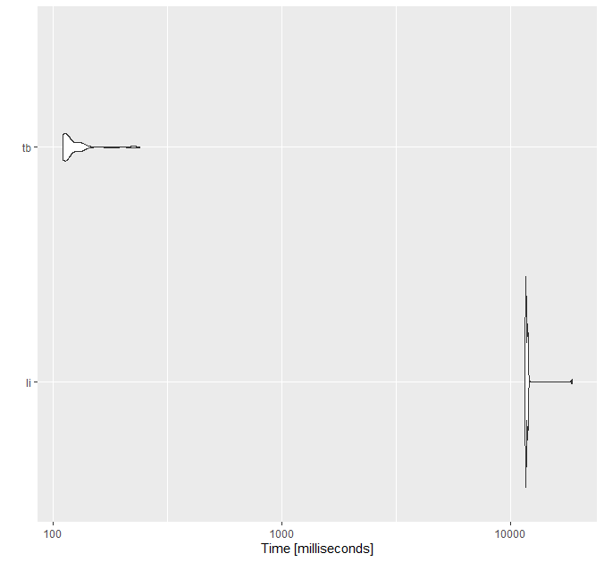

##### Multi-Simulation's second setup's graph

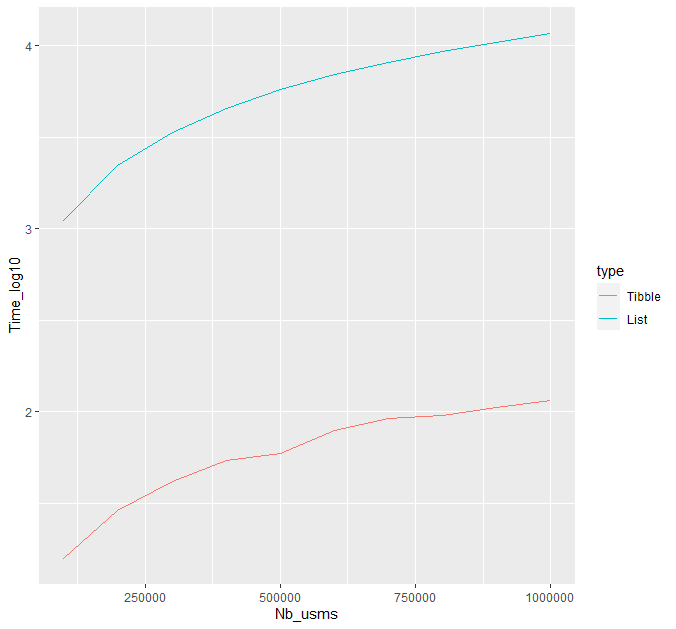

The results on this graph follow the results on the previous one. The Tibble storage method is more adapted to the multi-simulation use case than the List.

We can explain this by the fact that there are more operation done in the List function than in the Tibble function.

### Analysis' extraction test

#### First setup : DoE from 10K to 50K, 10 Usms and 289 Dates

```{r analysis first setup,eval=FALSE}
DoE <- c(10000,20000,30000,40000,50000)
li <- list()
tb <- list()
for (index in DoE) {

  analysis_tb <- create_tibble3(USM_list_1996,index,10,sim_data_289)
  analysis_li <- create_list2(USM_list_1996,index,10,sim_data_289)

  benchmark_analysis <- microbenchmark(li = list_get_DOE_and_var_values2(analysis_li,"lu96iN6_2","HR_3","1996/01/05"),
                                     tb = tibble_get_DOE_and_var_values(analysis_tb,"lu96iN6_2","HR_3","1996-01-05"),
                                     times = 100)
  print(benchmark_analysis)
  if (index == 10000) {
    li <- summary(benchmark_analysis)$median[1]
    tb <- summary(benchmark_analysis)$median[2]
  }
  else {
    li <- append(li,summary(benchmark_analysis)$median[1])
    tb <- append(tb,summary(benchmark_analysis)$median[2])
  }
  print(ggplot2::autoplot(benchmark_analysis))
  gc()
}
df <- data.frame(DoE_level = DoE,Time_log10 = log10(tb), type = "Tibble")
df2 <- data.frame(DoE_level = DoE,Time_log10 = log10(li), type="List")
final <- rbind(df,df2)
ggplot(final)+geom_line(aes(DoE_level,Time_log10,colour=type))
```

##### DoE = 50K

```{r analysis first setup 50K, eval=FALSE}
Unit: seconds
 expr      min       lq     mean   median       uq      max neval
   li 1.451001 1.599818 2.545515 2.178224  2.84946 14.13902   100
   tb 1.672656 5.368783 9.237114 9.672728 11.93672 21.91581   100
```
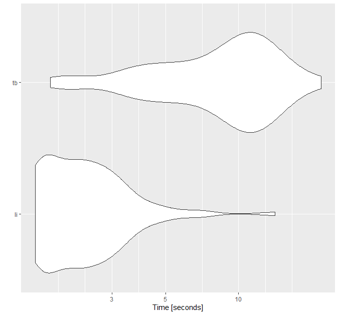

##### Analysis' first setup's graph

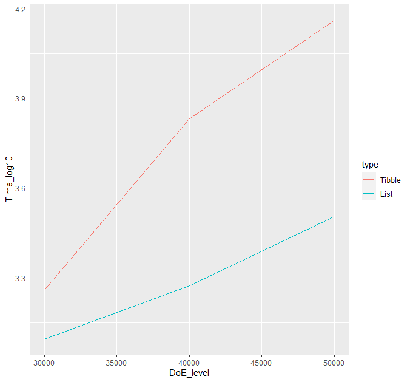

We can see that the List are faster than the Tibble on these tests.

#### Second setup : DoE from 10K to 50K, 10 Usms and 5 Dates

```{r analysis second setup,eval=FALSE}
DoE <- c(10000,20000,30000,40000,50000)
li <- list()
tb <- list()
for (index in DoE) {

  analysis_tb <- create_tibble3(USM_list_1996,index,10,sim_data_5)
  analysis_li <- create_list2(USM_list_1996,index,10,sim_data_5)

  benchmark_analysis <- microbenchmark(li = list_get_DOE_and_var_values2(analysis_li,"lu96iN6_2","HR_3","1996/01/05"),
                                     tb = tibble_get_DOE_and_var_values(analysis_tb,"lu96iN6_2","HR_3","1996-01-05"),
                                     times = 100)
  print(benchmark_analysis)
  if (index == 10000) {
    li <- summary(benchmark_analysis)$median[1]
    tb <- summary(benchmark_analysis)$median[2]
  }
  else {
    li <- append(li,summary(benchmark_analysis)$median[1])
    tb <- append(tb,summary(benchmark_analysis)$median[2])
  }
  print(ggplot2::autoplot(benchmark_analysis))
  gc()
}
df <- data.frame(DoE_level = DoE,Time_log10 = log10(tb), type = "Tibble")
df2 <- data.frame(DoE_level = DoE,Time_log10 = log10(li), type="List")
final <- rbind(df,df2)
ggplot(final)+geom_line(aes(DoE_level,Time_log10,colour=type))
```

##### DoE = 50K

```{r analysis second setup 50K, eval=FALSE}
Unit: milliseconds
 expr      min        lq      mean    median       uq      max neval
   li 572.6908 578.81865 590.97345 582.34080 588.6608 749.8459   100
   tb  41.5272  42.26995  43.26579  42.62525  43.2128  66.4805   100
```
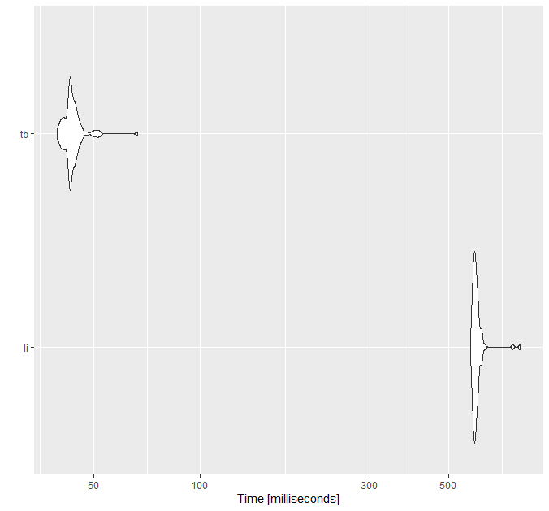

##### Analysis' second setup's graph

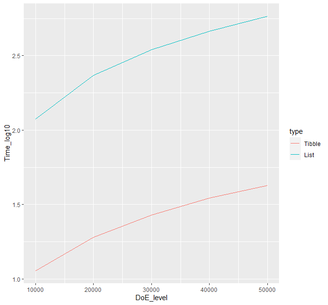

Unlikely to the previous results, this time it's the Tibble that is faster than the List. We maybe can explain that on the way the dplyr::filter function has been coded. Indeed, in the List function, the wanted Usms are get first, then their variables and values are processed while in the Tibble function, each tibble's row is tested. And this process takes more time when they are 289 dates per Usm than when they are only 5. We can also conclude that it is faster to search information in a tibble using the dplyr::filter function than in a List.

At the end of these tests, we cannot conclude on which storage method is the most suited because they both had won 3 tests. However, we can say that the Tibble storage method has the advantage because it won more tests on current use of extraction's functions than the List storage method.

# Annexes

## Optimization first setup

### DoE = 1

```{r opti 1 1, eval=FALSE}
Unit: microseconds
 expr   min     lq    mean median    uq    max neval
   li   8.6   9.15  26.174   9.85  10.8 1627.2   100
   tb 146.9 148.35 186.381 149.70 151.3 3042.4   100
```
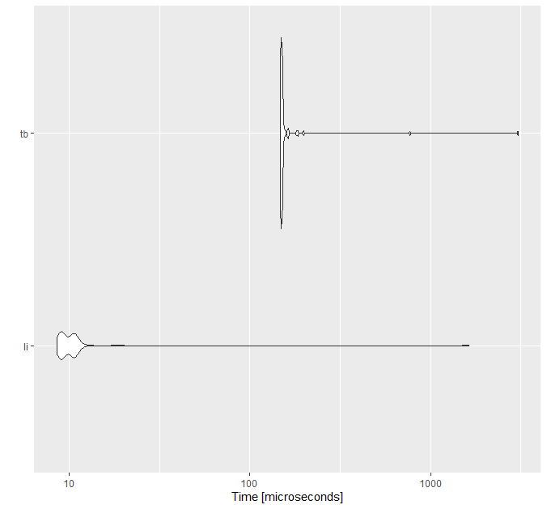

### DoE = 10K

```{r opti 1 10K, eval=FALSE}
Unit: microseconds
 expr      min       lq       mean   median       uq      max neval
   li      8.4     10.2     15.713     18.0     20.4     48.9   100
   tb 115675.8 118056.6 132426.305 119287.1 137102.6 370864.7   100
```


### DoE = 20K

```{r opti 1 20K, eval=FALSE}
Unit: microseconds
 expr      min        lq       mean    median       uq      max neval
   li      8.7      9.85     15.714     15.45     20.6     39.8   100
   tb 232682.4 235542.55 266596.692 237526.95 267068.4 797732.5   100
```
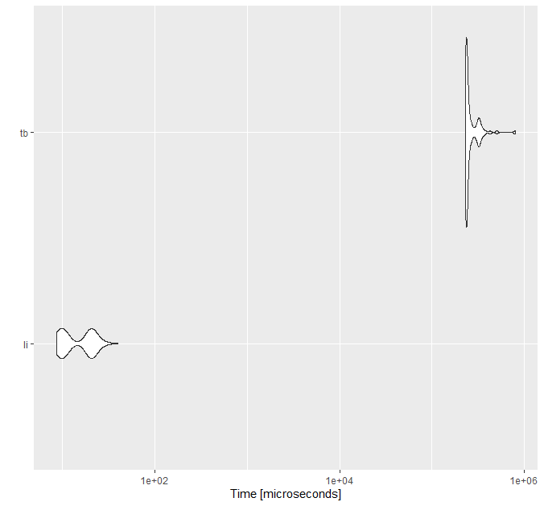

### DoE = 30K

```{r opti 1 30K, eval=FALSE}
Unit: microseconds
 expr      min        lq       mean    median        uq       max neval
   li      8.6     10.15     16.659     17.05     21.55      33.7   100
   tb 350982.7 355311.30 426618.585 358406.30 382779.05 2304141.1   100
```
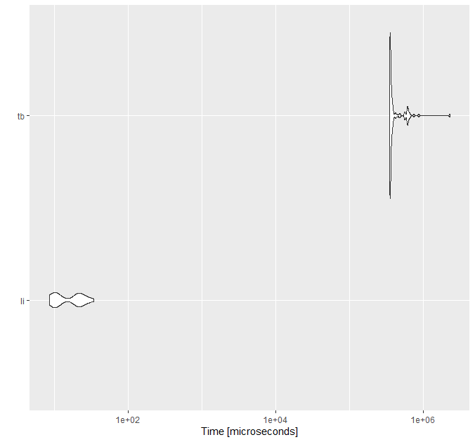

### DoE = 40K

```{r opti 1 40K, eval=FALSE}
Unit: microseconds
 expr        min         lq         mean      median          uq         max neval
   li      8.701      9.951     17.90196     11.8505     24.0015      67.901   100
   tb 471800.101 477465.601 625643.11201 500534.1510 520438.0510 4024280.902   100
```
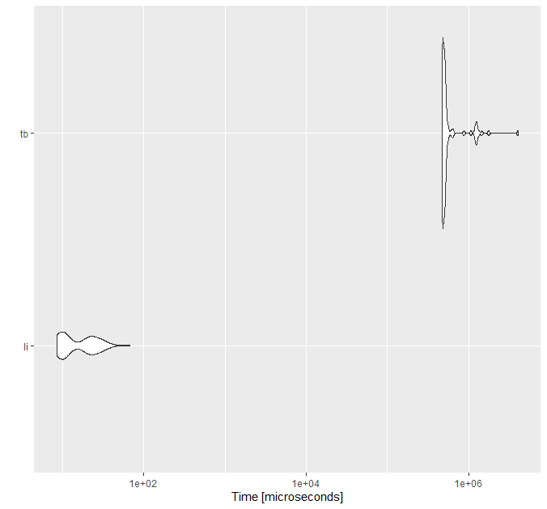

## Optimization second setup

### DoE = 1

```{r opti 2 1, eval=FALSE}
Unit: microseconds
 expr   min      lq      mean   median       uq      max neval
   li   9.4   9.901  27.33004  11.0005  11.5015 1660.500   100
   tb 127.8 130.001 171.84004 131.4010 133.3015 3208.001   100
```
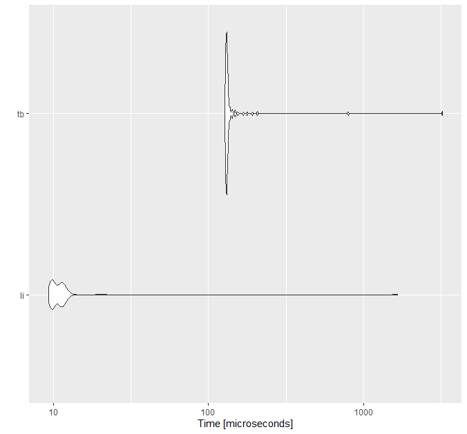

### DoE = 10K

```{r opti 2 10K, eval=FALSE}
Unit: microseconds
 expr     min       lq        mean    median        uq        max neval
   li     9.2    10.80    16.45996    17.551    21.201     57.802   100
   tb 78492.8 80416.95 91989.21306 82492.951 97015.701 295939.901   100
```
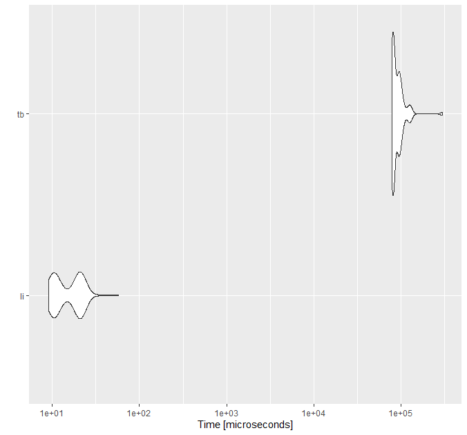

### DoE = 20K

```{r opti 2 20K, eval=FALSE}
Unit: microseconds
 expr        min          lq         mean      median          uq        max neval
   li      9.101     10.3015     16.02597     15.6505     21.1005     29.401   100
   tb 158601.201 161007.1510 182001.90508 162804.0010 183789.4015 454152.201   100
```
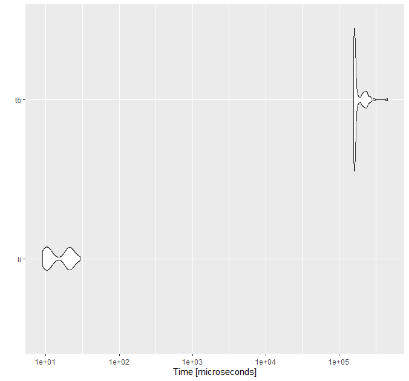

### DoE = 30K

```{r opti 2 30K, eval=FALSE}
Unit: microseconds
 expr        min         lq         mean      median         uq         max neval
   li      9.602     10.801     16.53806     16.3515     21.651      29.301   100
   tb 238471.001 242476.151 288057.92298 246753.6010 295745.701 1030967.502   100
```
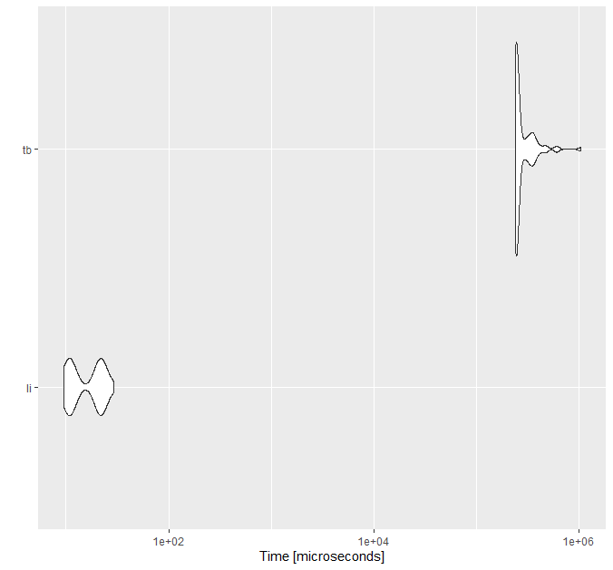

### DoE = 40K

```{r opti 2 40K, eval=FALSE}
Unit: microseconds
 expr        min          lq        mean      median         uq         max neval
   li      9.201     10.3515     17.4849     12.4515     21.901      94.401   100
   tb 320708.502 324527.1005 380501.9410 329340.0005 351341.650 1022214.702   100
```
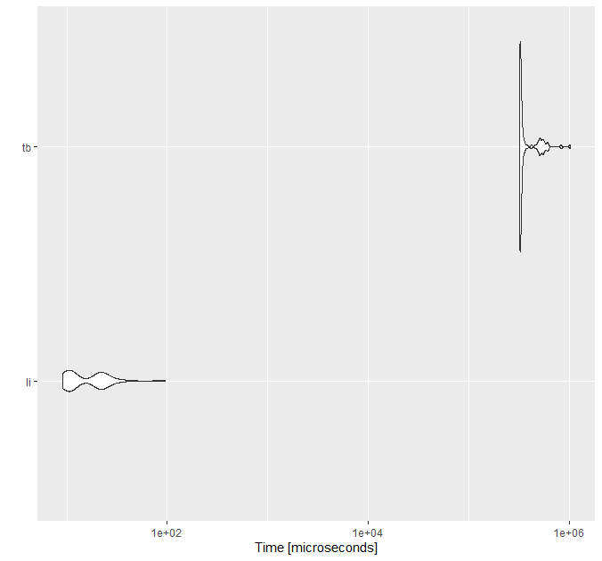

## Multi-Simulation first setup

### Usms = 100K

```{r multi 1 100K, eval=FALSE}
Unit: milliseconds
 expr       min        lq      mean   median       uq      max neval
   li 3379.0889 3579.2486 4018.0930 3790.463 4421.053 5221.642    10
   tb  541.0025  553.7962  856.7428  673.626 1249.987 1272.214    10
```
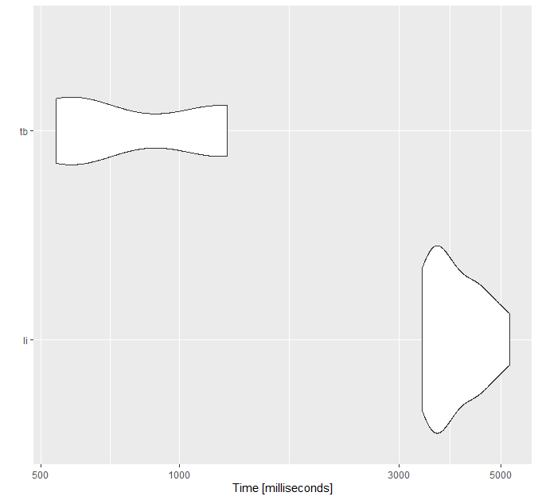

### Usms = 200K

```{r multi 1 200K, eval=FALSE}
Unit: seconds
 expr      min        lq      mean   median       uq      max neval
   li 9.875949 11.733033 13.412941 12.35984 12.89953 23.13303    10
   tb 1.246529  4.580581  7.933174  9.30585 11.43183 12.57116    10
```
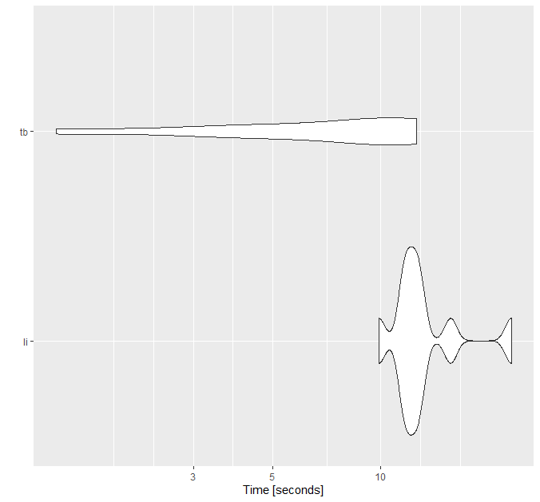

### Usms = 300K

```{r multi 1 300K, eval=FALSE}
Unit: seconds
 expr       min       lq     mean   median       uq      max neval
   li 34.724345 39.25414 43.24640 42.37673 42.92145 63.07541    10
   tb  9.739061 14.45071 17.96186 17.18580 19.08316 29.95370    10
```
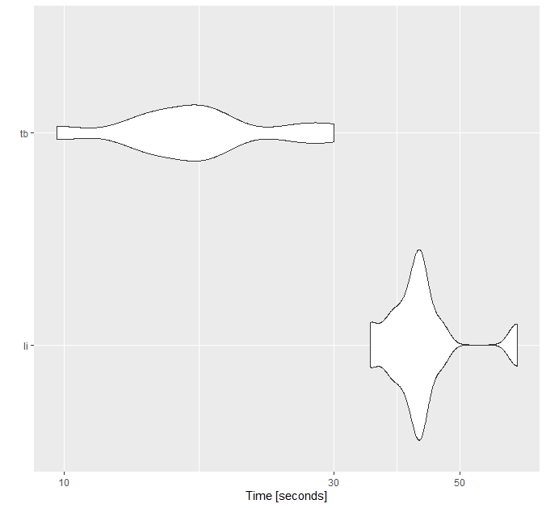

### Usms = 400K

```{r multi 1 400K, eval=FALSE}
Unit: seconds
 expr      min       lq     mean   median       uq      max neval
   li 48.00497 48.88886 53.82465 51.82287 59.84124 64.32469    10
   tb 14.45660 17.04424 18.42664 17.80213 18.67832 24.64189    10
```


## Multi-Simulation second setup

### Usms = 100K

```{r multi 2 100K, eval=FALSE}
Unit: milliseconds
 expr       min         lq       mean     median       uq       max neval
   li 1088.0238 1102.16540 1116.10545 1106.70015 1113.650 1329.0294   100
   tb   14.5051   14.93445   16.03744   15.80405   16.586   25.7652   100
```


### Usms = 200K

```{r multi 2 200K, eval=FALSE}
Unit: milliseconds
 expr       min         lq       mean    median        uq       max neval
   li 2150.3295 2207.03225 2232.33302 2217.5643 2242.5016 2432.7997   100
   tb   22.1346   25.65535   27.78092   28.6569   29.2289   37.4738   100
```
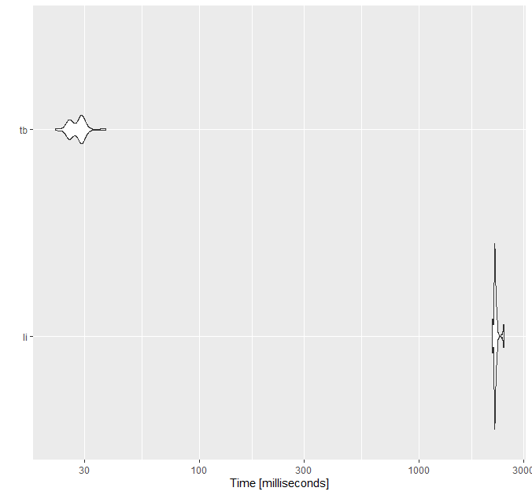

### Usms = 300K

```{r multi 2 300K, eval=FALSE}
Unit: milliseconds
 expr       min        lq       mean     median         uq       max neval
   li 3244.9939 3333.1485 3384.11247 3354.21600 3383.37670 3639.4534   100
   tb   36.4825   41.2495   42.00873   41.56275   42.19875   57.5007   100
```
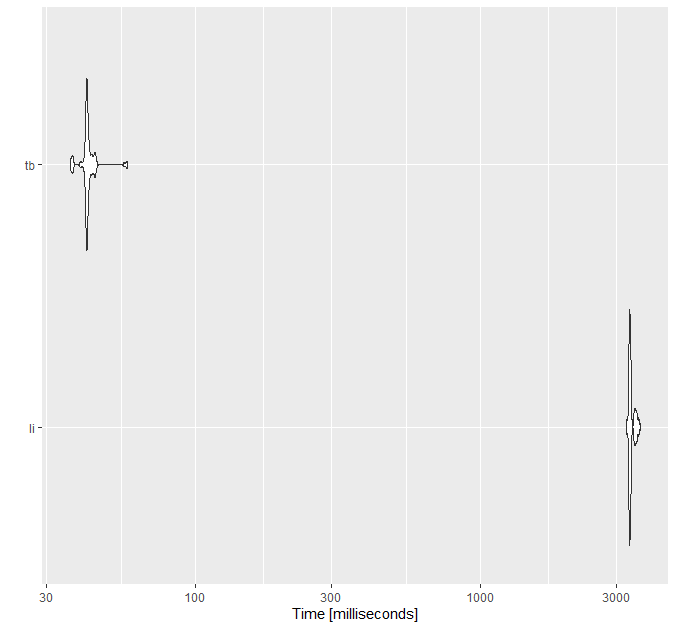

### Usms = 400K

```{r multi 2 400K, eval=FALSE}
Unit: milliseconds
 expr       min        lq       mean    median         uq       max neval
   li 4410.2640 4468.7386 4567.79492 4511.5391 4657.77315 4873.1753   100
   tb   49.6277   53.4986   58.25138   54.2582   55.64305  120.5135   100
```
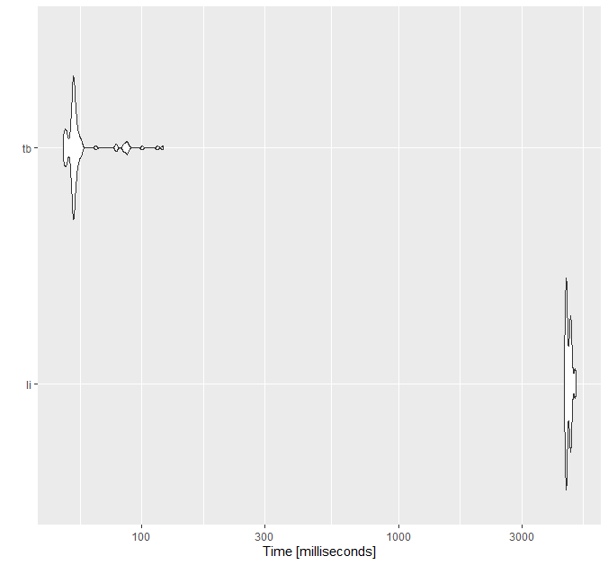

### Usms = 500K

```{r multi 2 500K, eval=FALSE}
Unit: milliseconds
 expr       min        lq       mean    median        uq       max neval
   li 5528.8481 5632.9156 5722.78715 5755.9341 5805.1352 5988.5920   100
   tb   54.9231   57.8324   65.91874   59.1574   63.1149  117.1691   100
```


### Usms = 600K

```{r multi 2 600K, eval=FALSE}
Unit: milliseconds
 expr       min         lq       mean     median         uq       max neval
   li 6689.3458 6921.03705 6950.86080 6937.67395 6961.27875 7157.0283   100
   tb   66.8157   68.89395   83.82181   79.15155   83.51865  137.0235   100
```


### Usms = 700K

```{r multi 2 700K, eval=FALSE}
Unit: milliseconds
 expr       min        lq      mean     median         uq       max neval
   li 7929.3581 8036.8161 8098.1972 8071.81925 8150.75185 8303.9721   100
   tb   77.6896   87.2805   97.8486   92.06255   95.33865  155.3712   100
```
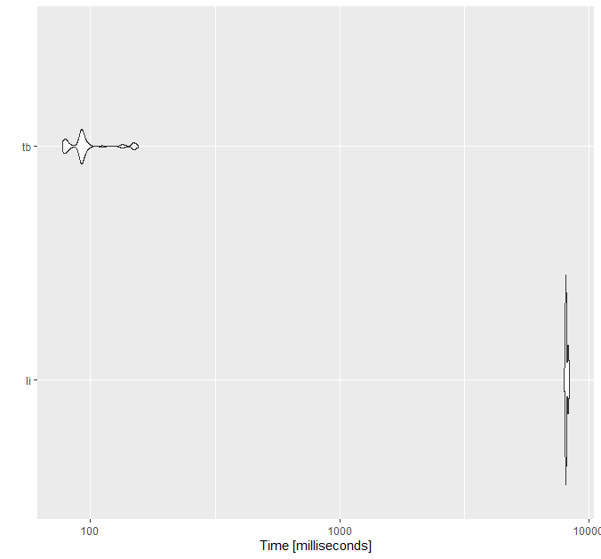

### Usms = 800K

```{r multi 2 800K, eval=FALSE}
Unit: milliseconds
 expr       min         lq      mean     median        uq       max neval
   li 9066.5991 9219.86695 9292.1561 9254.79895 9377.0507 9645.0329   100
   tb   89.2994   90.77525  103.9797   95.43965  106.9173  203.0872   100
```


### Usms = 900K

```{r multi 2 900K, eval=FALSE}
Unit: milliseconds
 expr        min         lq       mean     median         uq        max neval
   li 10308.5815 10419.0956 10491.5827 10458.4316 10527.7029 11640.7302   100
   tb   100.3078   100.9002   113.9623   105.3276   118.3651   210.0611   100
```
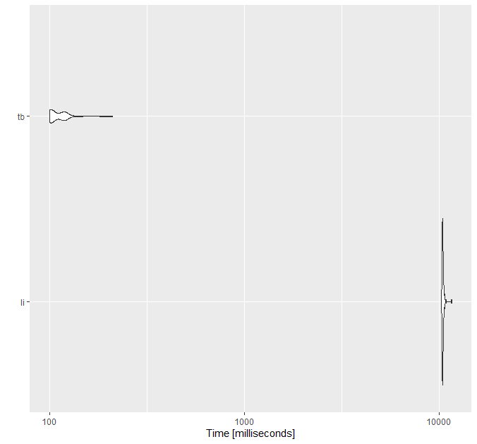

## Analysis first setup

### DoE = 10K

```{r analysis 1 10K, eval=FALSE}
Unit: milliseconds
 expr      min       lq     mean   median       uq      max neval
   li 282.6968 293.9241 339.3505 330.6117 369.7605 582.6753   100
   tb 333.5801 336.8654 374.8506 340.2402 353.6569 757.5860   100
```
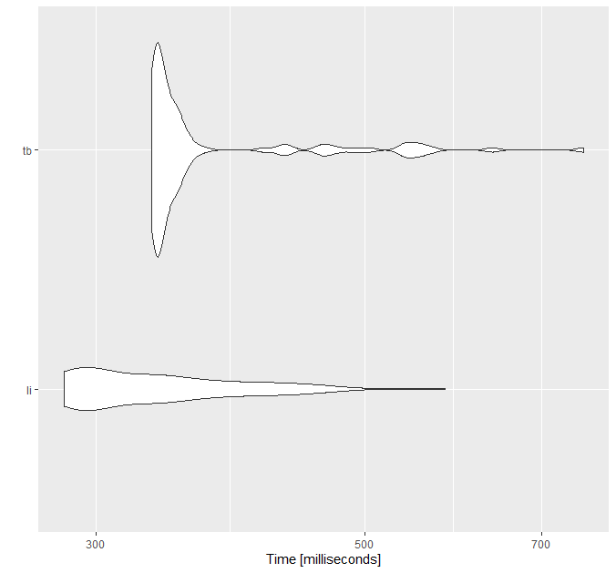

### DoE = 20K

```{r analysis 1 20K, eval=FALSE}
Unit: milliseconds
 expr     min       lq     mean   median       uq      max neval
   li 574.423 596.6466 742.7338 682.8537 844.5368 1417.813   100
   tb 664.707 721.9076 827.1570 772.0500 806.6606 2102.566   100
```
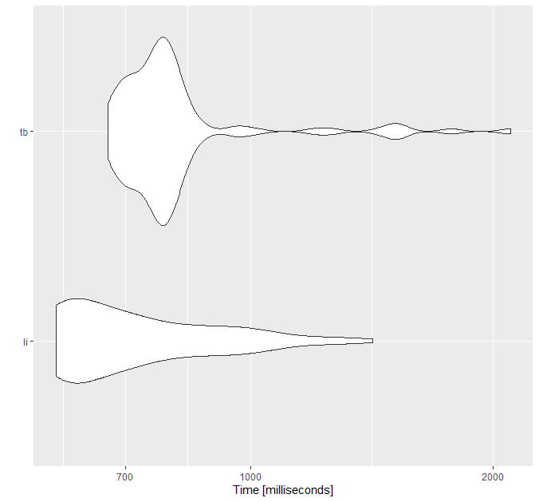

```{r analysis 1 30K, eval=FALSE}
Unit: milliseconds
 expr       min        lq     mean   median      uq      max neval
   li  853.7841  893.7934 1134.345 1007.887 1225.57 2283.683   100
   tb 1005.3673 1096.2543 1580.385 1163.499 1585.62 6333.897   100
```
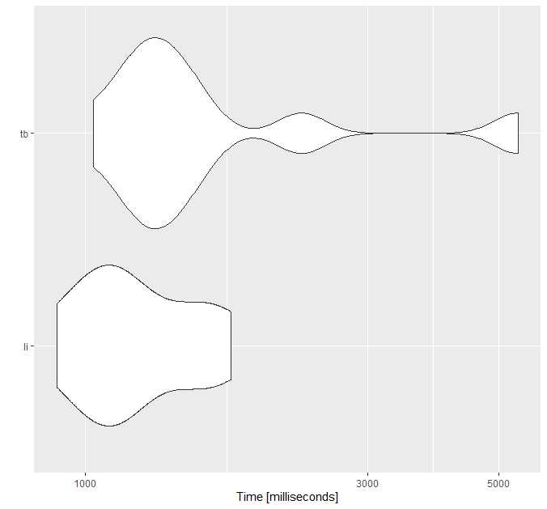

```{r analysis 1 40K, eval=FALSE}
Unit: seconds
 expr     min       lq     mean   median       uq       max neval
   li 1.15955 1.277410 1.824324 1.625104 2.103056  4.902927   100
   tb 1.48281 2.351267 5.390992 4.366776 6.793934 24.125125   100
```
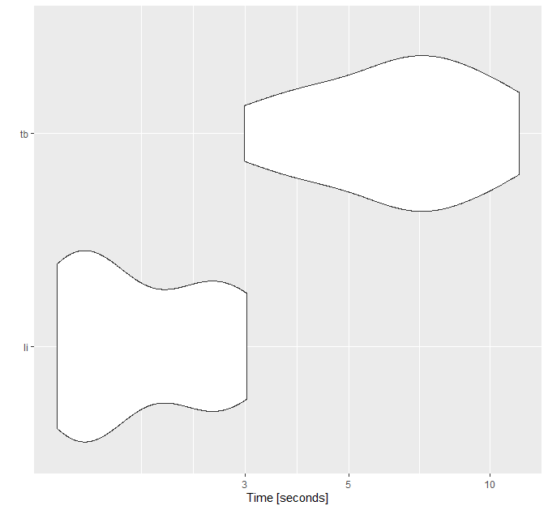

## Analysis second setup

### DoE = 10K

```{r analysis 2 10K, eval=FALSE}
Unit: milliseconds
 expr     min       lq      mean    median       uq      max neval
   li 111.151 115.9031 120.12383 118.62490 120.5802 258.1678   100
   tb  10.478  11.0022  11.91204  11.37195  11.6097  25.5061   100
```
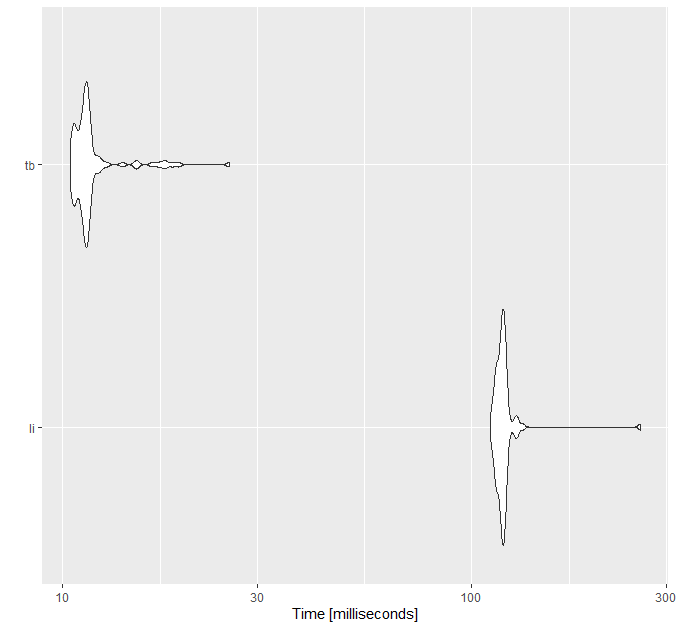

### DoE = 20K

```{r analysis 2 20K, eval=FALSE}
Unit: milliseconds
 expr      min       lq      mean   median       uq      max neval
   li 224.6706 229.3868 234.99459 233.5398 236.5246 387.2867   100
   tb  18.6105  18.8324  21.23352  19.0604  19.3574 179.9424   100
```
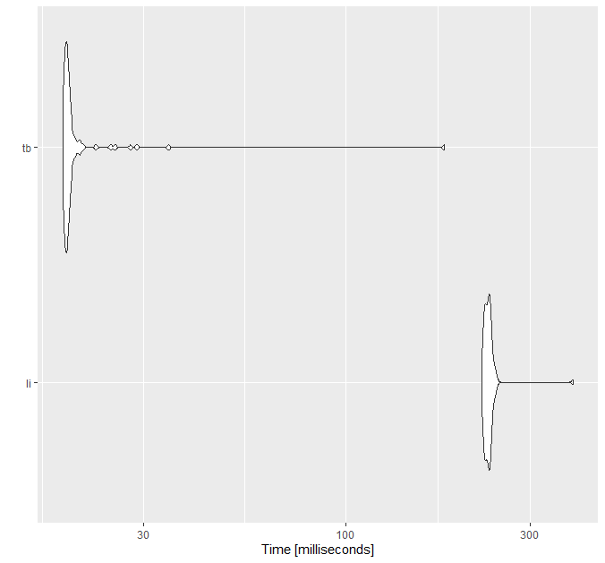

```{r analysis 2 30K, eval=FALSE}
Unit: milliseconds
 expr      min       lq      mean   median       uq      max neval
   li 337.3563 344.8231 357.99463 347.2255 352.0751 501.4782   100
   tb  26.2836  26.7208  28.32191  26.9891  27.4553  46.1429   100
```
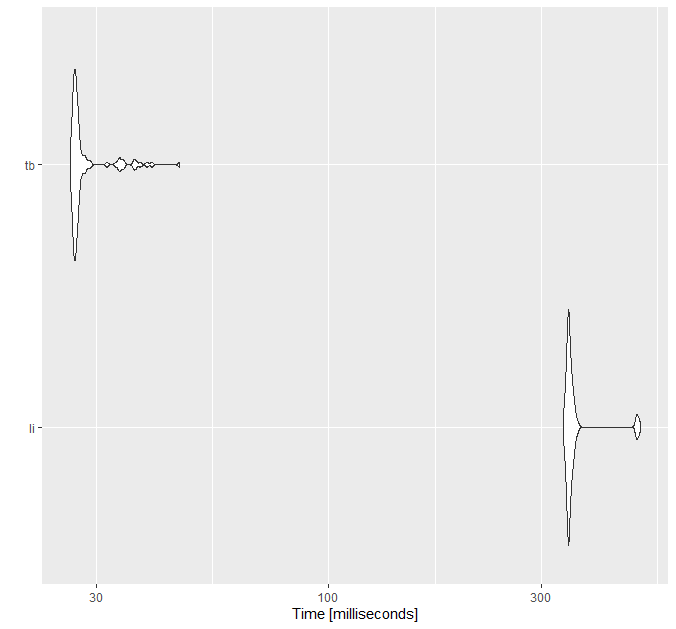

```{r analysis 2 40K, eval=FALSE}
Unit: milliseconds
 expr      min       lq      mean   median        uq      max neval
   li 448.5105 458.7205 468.55195 463.1826 469.84395 625.1621   100
   tb  33.8663  34.4889  35.47545  34.8803  35.30425  55.3542   100
```
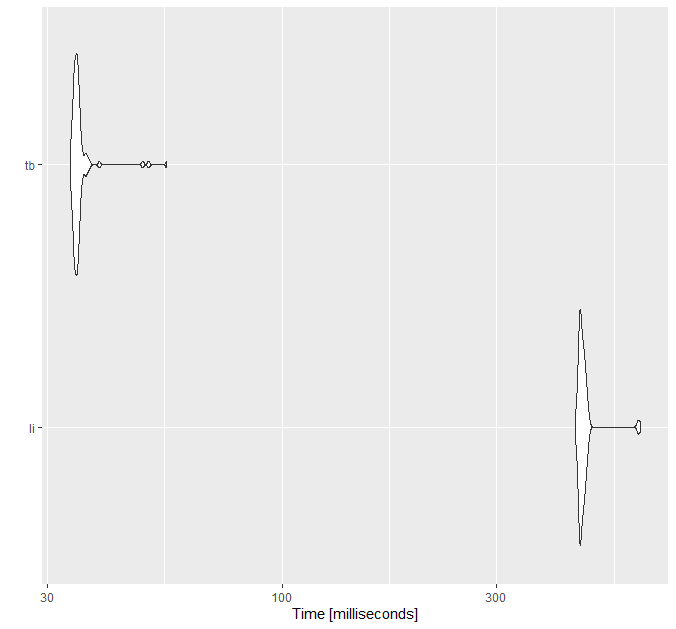
